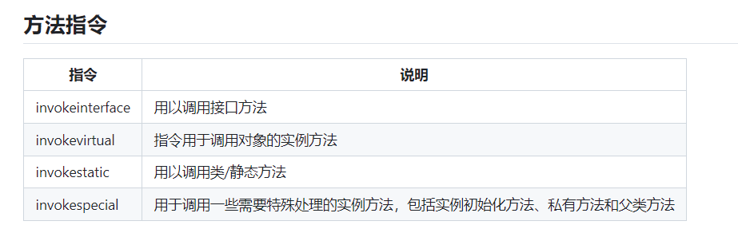

[toc]

## 1. 类，接口和对象

### 类（Class）

**定义**： 类是一个模板，它定义了一类对象的共同行为和状态。类可以包含字段（属性）和方法（行为）。

其实就是：类包含属性和行为。

**举例**：

```
public class Car {
    // 字段
    private String color;
    private int maxSpeed;

    // 构造方法
    public Car(String color, int maxSpeed) {
        this.color = color;
        this.maxSpeed = maxSpeed;
    }

    // 方法
    public void accelerate() {
        System.out.println("Car is accelerating.");
    }
}
```

在这个例子中，`Car` 是一个类，它有两个字段 `color` 和 `maxSpeed`，一个构造方法用来初始化这些字段，以及一个方法 `accelerate` 来描述汽车加速的行为。

### 对象（Object）

**定义**： 对象是类的一个实例。通过类定义创建对象的过程称为实例化。每个对象都会继承类的结构和行为，但可以持有自己的属性值。

对象会继承类的行为，同时拥有自己的属性值。

**举例**：

```
Car myCar = new Car("Red", 150);
myCar.accelerate();
```

在这里，`myCar` 是 `Car` 类的一个对象。它被创建（实例化）并初始化为红色，最大速度为150。调用 `accelerate` 方法时，输出将表明这辆车正在加速。

### 接口（Interface）

**定义**：接口定义了一组必须其它类共有的行为，这为不同的类提供了一个共同的行为框架。这样做可以确保所有实现该接口的类都会按照相同的方式响应特定的方法调用，是Java实现多态和提高代码模块化的关键机制。

**举例**：

定义接口

```
public interface Controllable {
    void turnOn();
    void turnOff();
}
```

然后，我们可以有一个类实现这个接口：

```
public class Television implements Controllable {
    @Override
    public void turnOn() {
        System.out.println("Television turning on.");
    }

    @Override
    public void turnOff() {
        System.out.println("Television turning off.");
    }
}

public class Speaker implements Controllable {
    @Override
    public void turnOn() {
        System.out.println("Speaker turning on.");
    }

    @Override
    public void turnOff() {
        System.out.println("Speaker turning off.");
    }
}
```

使用接口：

创建一个函数，它接受一个`Controllable`类型的对象。这个函数不关心具体的设备类型，只知道它可以开启和关闭，这正是接口带来的好处：**抽象**和**多态**。

```
public class RemoteControl {
    public void togglePower(Controllable device) {
        device.turnOn();
        device.turnOff();
    }
}

public class Main {
    public static void main(String[] args) {
        Television tv = new Television();
        Speaker speaker = new Speaker();
        RemoteControl remote = new RemoteControl();

        remote.togglePower(tv);
        remote.togglePower(speaker);
    }
}
```

在这个例子中，无论是电视还是音箱，都被视为`Controllable`对象。`RemoteControl`类使用`Controllable`接口操作所有设备，无需知道具体是哪种设备。这种设计使得添加新设备变得非常容易，只需确保新设备实现`Controllable`接口即可。


总结：

类是对象的蓝图，由属性和行为构成的。对象继承了类的行为，同时有着自己的属性值。接口则是定义了一组不同类所拥有的共有行为，为不同的类提供了一个统一的行为框架。这样做可以保证所有实现该接口的类都能够以同样的方式去响应对应的方法调用。


类的元数据、静态变量，编译后的字节码以及符号引用等都存储在方法区


## 2. 方法指令




在Java虚拟机（JVM）中，方法调用是通过特定的指令来完成的。这些指令是Java字节码的一部分，它们指示JVM如何调用方法。

### 1. `invokeinterface`

**用途**：这条指令用于调用接口中定义的方法。

**工作机制**：当一个类实现了一个接口，它必须提供那个接口所有方法的具体实现。在运行时，当代码调用一个接口方法时，JVM使用`invokeinterface`指令来定位这个方法的具体实现。这种查找是动态的，意味着实现方法的查找发生在程序运行时。

**例子**：

```
public interface Movable {
    void move();
}

public class Animal implements Movable {
    @Override
    public void move() {
        System.out.println("Animal moves");
    }
}

Movable m = new Animal();
m.move();  // 使用 invokeinterface
```

### 2. `invokevirtual`

**用途**：用于调用对象的实例方法，不包括构造方法、私有方法以及父类方法。

**工作机制**：这是最常用的方法调用指令，它依赖于对象的动态类型（即实际类型）来确定应当调用哪个类的方法。这支持Java的多态特性，即同一个方法调用可以根据对象的实际类型执行不同类中的方法实现。

**例子**：

```
public class Animal {
    public void eat() {
        System.out.println("Animal eats");
    }
}

Animal a = new Animal();
a.eat();  // 使用 invokevirtual
```

### 3. `invokestatic`

**用途**：用于调用一个类的静态方法。

**工作机制**：静态方法与类的任何对象实例无关，因此`invokestatic`指令不需要对象引用，而是直接在类级别上操作。这种调用是基于类而不是对象的。

**例子**：

```
public class MathUtility {
    public static int add(int x, int y) {
        return x + y;
    }
}

int result = MathUtility.add(5, 3);  // 使用 invokestatic
```

### 4. `invokespecial`

### 多态的背景

在Java中，多态是一种允许行为在不同类的对象上以不同方式表现的机制。通常通过重写父类的方法来实现。


### `invokespecial`的使用场景

与`invokevirtual`不同，`invokespecial`用于以下特定情况：

1. **构造器调用 (`<init>` 方法)**：构造器是用来初始化新创建的对象的特殊类型方法。每个构造器都是独特的，它对应其类，且不会被继承或覆盖。因此，调用构造器时，需要确保调用的是正确的构造器，不涉及任何多态行为。
2. **私有方法调用**：私有方法是类内部的方法，不能被外部访问，也不会被子类继承。因此，它们不能被覆盖或多态调用。调用私有方法时，需要确保调用的是声明该方法的类中的实现，而不是任何其他版本。
3. **父类方法的特殊调用**：当在子类中需要调用被子类重写的父类方法时（通常使用`super`关键字），这种调用也必须直接定位到父类的具体方法实现。这同样不涉及多态，因为目的是明确调用父类的方法，而不是任何可能的重写版本。

虽然这三种情况看似不同，但它们共享一个关键特征：**在这些情况下，方法的调用必须绕过常规的多态方法查找机制。**


### 1. 构造器调用的示例

当你创建一个类的实例时，你需要调用构造器来初始化对象。在Java中，每个类都至少有一个构造器，如果没有显式定义，编译器会提供一个默认的无参数构造器。以下是一个具体的例子，展示了构造器的定义和使用：

```
public class Person {
    private String name;
    private int age;

    // 构造器
    public Person(String name, int age) {
        this.name = name;  // 使用 invokespecial 来引用 Object 类的构造方法
        this.age = age;
    }
}

public class Main {
    public static void main(String[] args) {
        Person person = new Person("Alice", 30);  // 调用 Person 类的构造器
    }
}
```

在这个例子中：

- `Person` 类有一个构造器，接受`name`和`age`两个参数。
- 当创建`Person`类的一个实例时，例如在`main`方法中，`new Person("Alice", 30)`会使用`invokespecial`指令调用`Person`类的构造器。这个指令直接调用指定的构造器，不涉及多态。

### 2. 私有方法调用的示例

私有方法是类内部使用的方法，它们不可被其他类访问，也不被子类继承。私有方法通常用于执行类内部的辅助功能，不希望外部代码干预。以下是一个使用私有方法的例子：

```
public class Account {
    private double balance;

    public Account(double initialBalance) {
        setBalance(initialBalance);
    }

    public void deposit(double amount) {
        if (amount > 0) {
            addAmount(amount);  // 使用 invokespecial 调用私有方法
        }
    }

    private void addAmount(double amount) {
        this.balance += amount;
    }
}

public class Main {
    public static void main(String[] args) {
        Account myAccount = new Account(100.0);
        myAccount.deposit(50.0);
    }
}
```

在这个例子中：

- `Account` 类有一个私有方法`addAmount`，它用于更新账户余额。
- `deposit`方法在验证存款金额为正后，会调用`addAmount`方法。由于`addAmount`是私有的，这里的方法调用会使用`invokespecial`指令。这个指令确保调用的是`Account`类中定义的`addAmount`方法，不考虑多态和方法重写的可能性。

### 3.父类方法的特殊调用

**例子**：

```
public class Animal {
    public void eat() {
        System.out.println("Animal eats");
    }
}

public class Dog extends Animal {
    @Override
    public void eat() {
        System.out.println("Dog eats");
    }

    public void myMethod() {
        super.eat();  // 使用 invokespecial
    }
}
```

- `Animal`类定义了一个`eat`方法。
- `Dog`类继承了`Animal`类，并重写了`eat`方法以提供不同的实现。


### 总结

在这三个示例中，`invokespecial`指令用于确保方法调用是直接和非多态的。对于构造器，它确保对象被正确初始化；对于私有方法，它确保内部逻辑不被外部访问或修改，维护了类的封装性。对于父类方法的特殊调用，它确保使用的是父类方法，而非被多态影响。这种直接方法调用在需要明确调用特定方法实现时非常重要，避免了多态引入的复杂性。


invokevirtual用于所有可能存在多态的方法调用中，而对于构造器，私有方法，父类本身的方法这些没有被多态的，则使用invokespecial


`invokevirtual` 指令用于调用对象的实例方法，考虑到多态的可能性。这意味着实际执行的方法取决于对象的实际类类型，这是在运行时才确定的

`invokespecial` 用于那些需要特殊处理的方法调用，包括初始化方法、私有方法和父类方法。这些方法调用不依赖类的动态类型，而是依赖类的静态类型。

### 再次总结：

- **`invokespecial`**：这个指令用于那些其调用不应受子类影响的方法，如构造函数、私有方法和使用`super`关键字的方法调用。这些调用被视为静态绑定，因为它们不依赖于对象的运行时类型。
- **`invokevirtual`**：用于调用那些可能被对象的实际类型所影响的方法，即涉及多态性的方法。这种调用被视为动态绑定，因为必须在运行时解析要调用的方法的实际版本。

同时，所有的方法都存放在方法区中。


## 补充：多态和继承

### 类和继承结构

首先，我们有两个类：`Animal`（基类）和`Dog`（派生类）：

```java
public class Animal {
    public void eat() {
        System.out.println("Animal eats");
    }
}

public class Dog extends Animal {
    @Override
    public void eat() {
        System.out.println("Dog eats");
    }
}
```

在这里：

- `Animal`类定义了一个`eat`方法。
- `Dog`类继承了`Animal`类，并重写了`eat`方法以提供不同的实现。

### 多态和方法覆盖

由于多态性，如果我们创建了一个`Dog`对象并调用`eat`方法，它会调用`Dog`类中的版本，因为这个方法被重写了：

```
Dog myDog = new Dog();
myDog.eat();  // 输出 "Dog eats"
```

### 使用`super`调用父类方法

然而，有时候我们需要在子类中调用被覆盖的父类方法。这可以通过使用`super`关键字来实现。`super`允许子类引用父类的属性和方法：

```java
public class Dog extends Animal {
    @Override
    public void eat() {
        System.out.println("Dog eats");
    }

    public void myMethod() {
        super.eat();  // 调用 Animal 类的 eat 方法
    }
}
```

在`Dog`的`myMethod`方法中，`super.eat();`是一个明确的指令，告诉Java虚拟机（JVM）调用`Animal`类中的`eat`方法，而不是`Dog`类中的。这是必要的，特别是当子类需要扩展而不是完全替换父类方法的行为时。

### `invokespecial` 指令

在Java字节码中，`super.eat();`这一调用被转换为`invokespecial`指令。`invokespecial`用于处理需要特殊处理的方法调用，包括初始化方法、私有方法和通过`super`关键字调用的方法。它确保调用的是指定类中的方法，避免了方法调用中的多态查找过程。