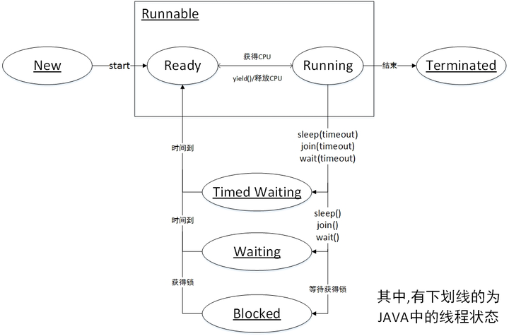

[toc]

## 1.线程

进程是资源分配的基本单位，线程是调度的基本单位，统一进程中的线程可以共享进程的资源：如：内存空间和文件句柄。

## 2. 属性

| 属性     | 说明                                                         |
| -------- | ------------------------------------------------------------ |
| id       | 线程 id 用于标识不同的线程。编号可能被后续创建的线程使用。编号是只读属性，不能修改 |
| name     | 名字的默认值是 Thread-(id)                                   |
| daemon   | 分为守护线程和用户线程，我们可以通过 setDaemon(true) 把线程设置为守护线程。守护线程通常用于执行不重要的任务，比如监控其他线程的运行情况，GC 线程就是一个守护线程。setDaemon() 要在线程启动前设置，否则 JVM 会抛出非法线程状态异常，可被继承。 |
| priority | 线程调度器会根据这个值来决定优先运行哪个线程（不保证），优先级的取值范围为 1~10，默认值是 5，可被继承。Thread 中定义了下面三个优先级常量： - 最低优先级：MIN_PRIORITY = 1 - 默认优先级：NORM_PRIORITY = 5 - 最高优先级：MAX_PRIORITY = 10 |

补充：守护线程 (`daemon`)

- **说明**：守护线程主要用于程序中后台调度以及支持性工作，这类线程不阻止JVM的终止。当所有非守护线程结束时，JVM也就终止了，同时会杀死所有守护线程。
- **应用**：常见的守护线程有垃圾回收线程（GC）。开发者可以通过`setDaemon(true)`将自定义线程设置为守护线程，这种设置必须在线程启动之前完成。

## 3.状态

| 状态          | 说明                                                         |
| ------------- | ------------------------------------------------------------ |
| New           | 新创建了一个线程对象，但还没有调用start()方法。              |
| Runnable      | Ready 状态 线程对象创建后，其他线程(比如 main 线程）调用了该对象的 start() 方法。该状态的线程位于可运行线程池中，等待被线程调度选中 获取 cpu 的使用权。Running 绪状态的线程在获得 CPU 时间片后变为运行中状态（running）。 |
| Blocked       | 线程因为某种原因放弃了cpu 使用权（等待锁），暂时停止运行     |
| Waiting       | 无限等待，线程进入等待状态因为以下几个方法： - Object#wait() - Thread#join() - LockSupport#park() |
| Timed Waiting | 有等待时间的等待状态。                                       |
| Terminated    | 表示该线程已经执行完毕。                                     |

### 1. **New (新建状态)**

- **说明**：当线程对象被创建后，即实例化后，但在调用 `start()` 方法之前，线程处于这种状态。
- **特点**：在这个状态下，线程尚未开始执行。

### 2. **Runnable (可运行状态)**

- **说明**：当线程调用了 `start()` 方法后，它进入可运行状态。在这个状态下，线程可能正在运行也可能正在等待CPU调度（即获取CPU时间片），具体取决于操作系统的线程调度器。

- 细分

  ：

  - **Ready**：线程已准备好运行并等待CPU调度。
  - **Running**：线程实际获得CPU并执行其 `run()` 方法的代码。

### 3. **Blocked (阻塞状态)**

- **说明**：线程在等待一个监视器锁（分配给对象的锁）以进入一个同步块/方法，或者再次进入一个同步块/方法时，线程进入阻塞状态。
- **特点**：线程在此状态因为等待获取锁而不能继续执行。

### 4. **Waiting (无限等待状态)**

- 说明

  ：线程进入等待状态是因为调用了如下方法：

  - `Object.wait()` 时没有指定 timeout 参数
  - `Thread.join()` 时没有指定 timeout 参数
  - `LockSupport.park()`

- **特点**：在这个状态下，线程等待其他线程明确地唤醒（通过 `notify()`, `notifyAll()`, 或 `LockSupport.unpark()`），不考虑中断。

### 5. **Timed Waiting (有时限的等待状态)**

- 说明

  ：线程进入有时间限制的等待状态是因为调用了以下方法之一：

  - `Thread.sleep(long millis)`
  - `Object.wait(long timeout)`
  - `Thread.join(long millis)`
  - `LockSupport.parkNanos()`
  - `LockSupport.parkUntil()`

- **特点**：线程在指定的等待时间内无法执行，等待时间过后，线程将自动返回到Runnable状态，除非条件得到满足或者被中断。

### 6. **Terminated (终止状态)**

- **说明**：当线程的 `run()` 方法执行完成后，它将自动进入终止状态。
- **特点**：线程一旦终止，就不能再重新启动。

## 4.状态控制

| 方法           | 说明                                                         |
| -------------- | ------------------------------------------------------------ |
| `wait()`       | 线程状态由 Running 变为 Waiting, 并将当前线程放入等待队列中  |
| `notify()`     | notify() 方法是将等待队列中一个等待线程从等待队列移动到同步队列中 |
| `notifyAll() ` | 则是将所有等待队列中的线程移动到同步队列中                   |

#### 1. `wait()`, `notify()`, `notifyAll()`

其是Objcet类的方法。跟同步和互斥有关。

`wait()`  线程状态由 Running 变为 Waiting, 并将当前线程放入等待队列中

`notify()`  notify() 方法是将等待队列中一个等待线程从等待队列移动到同步队列中

`notifyAll() `  则是将所有等待队列中的线程移动到同步队列中

这里要补充说明：同步队列，等待队列。参考2.17

#### 2. `join()`, `sleep()`, `yield()`

这些方法用于控制线程的执行和协调。

- **`join()`**
  - **作用**：等待调用 `join()` 方法的线程结束其生命周期。如果在A线程中调用B线程的 `join()` 方法，A线程将会等待B线程结束后再继续执行。
  - **锁的释放**：在等待期间，`join()` 方法会释放持有的所有监视器锁。
- **`sleep(long millis)`**
  - **作用**：使当前线程暂停执行指定的时间（以毫秒为单位），不释放任何资源或锁。
  - **状态变化**：线程进入 `Timed Waiting` 状态。
- **`yield()`**
  - **作用**：使当前线程让步，即放弃当前的CPU资源，将它们让给其他相同优先级的待执行线程。具体行为取决于具体的线程调度器的实现。
  - **状态变化**：线程暂时从 `Running` 状态回到 `Runnable` 状态，等待再次被调度。

### 重要性和应用场景

这些方法的正确使用对于设计高效、无死锁的多线程应用程序至关重要。例如：

- 使用 `wait()` 和 `notify()` 或 `notifyAll()` 可以实现高效的生产者-消费者模式。
- 使用 `join()` 可以在启动一个线程进行异步处理任务后，合适的时候等待其结果。
- `sleep()` 可用于模拟长时间操作或给其他线程执行的机会。
- `yield()` 可以用来临时暂停当前正在执行的线程，来让有同样优先级的正在等待的线程有机会执行。

值得注意的是：`sleep(long)` 方法在睡眠时不释放对象锁，而 `join()` 方法在等待的过程中释放对象锁。
