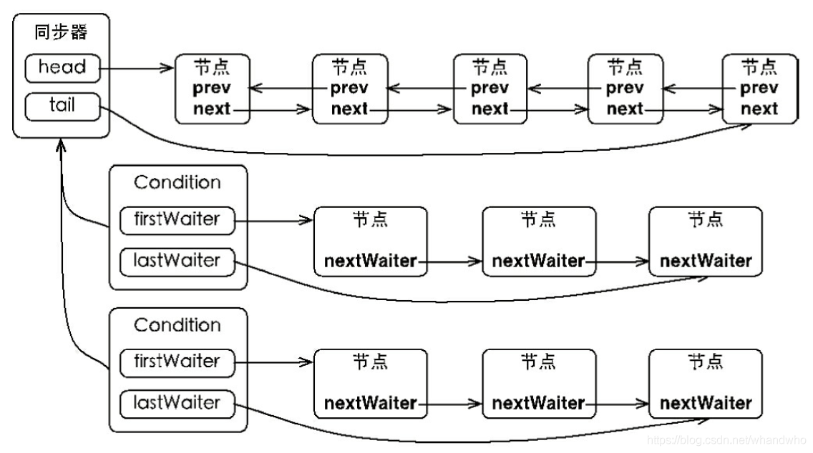
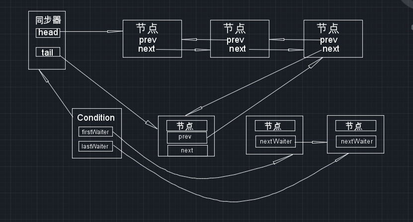

[toc]

reentrantlock是基于同步器AQS实现的，在AQS中可以存在一个或者多个ConditionObject。1个ConditionObject管理1个单向链表的等待队列；而1个AQS自己管理一个双向的同步队列，如下图：

 

当一个线程执行了wait方法以后，该线程会释放本身掌握的锁对象，而且将本身封装成一个Node节点，加入到对应condition的等待队列的尾节点以后。demo如下：

### **等待队列和同步队列是如何配合的**：

概述：等待队列就像队列名字同样，存储的是全部在condition上进行等待的线程Node。当线程被唤醒后，线程并非立刻就获得对象的使用权，而是进入到同步队列中进行排队来使用锁。

