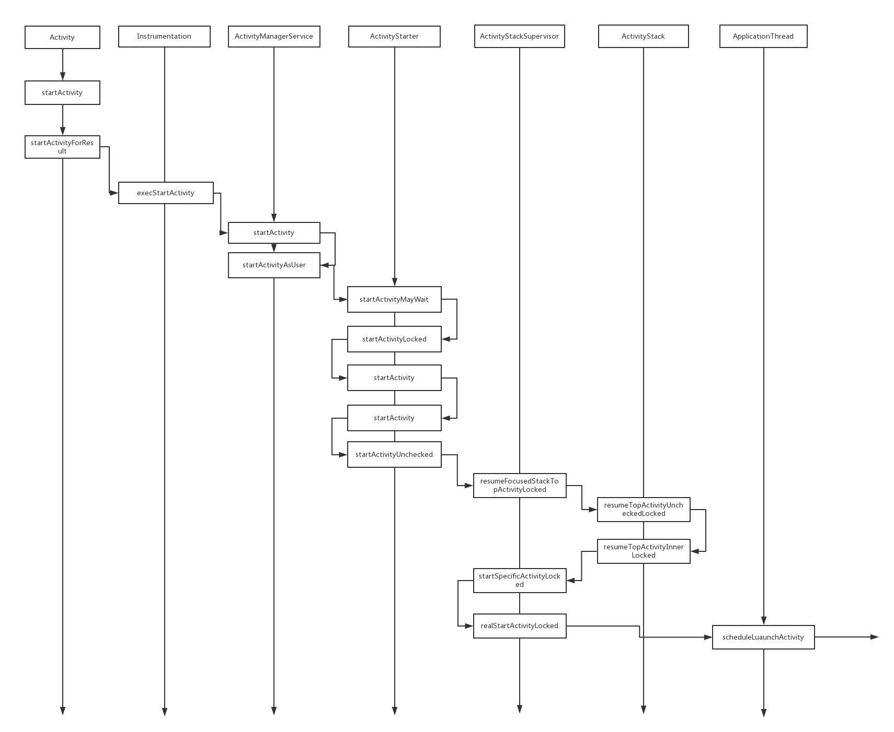

[toc]



这张图展示了从调用 `startActivity` 方法到 `ActivityThread` 处理 `scheduleLaunchActivity` 的整个流程。下面是关键步骤：

1. ### 1. 应用中调用 `startActivity`

   ```java
   Intent intent = new Intent(this, SecondActivity.class);
   startActivity(intent);
   ```

   - **调用者**：`Activity` 类。
   - **意义**：这是启动一个新 Activity 的标准方法。开发者在应用中调用这个方法来启动另一个 Activity。

   ### 2. `Instrumentation` 类

   ```java
   public void execStartActivity(...) {
       // 传递启动请求给 ActivityManagerService
       ActivityManagerNative.getDefault().startActivity(...);
   }
   ```

   - **调用者**：`Activity` 类的 `startActivity` 方法最终调用到 `Instrumentation` 类。
   - **意义**：`Instrumentation` 是一个用来监控和控制应用程序的运行环境。`execStartActivity` 方法用于将启动 Activity 的请求传递给系统服务。

   ### 3. `ActivityManagerService` 类

   ```java
   public int startActivity(...) {
       return startActivityAsUser(...);
   }
   
   public int startActivityAsUser(...) {
       // 处理启动请求
       return mActivityStarter.startActivityMayWait(...);
   }
   ```

   - **调用者**：系统服务。
   - **意义**：`ActivityManagerService` 是系统服务，负责管理所有 Activity 的生命周期和任务栈。它接收启动 Activity 的请求，并进行权限检查和任务栈管理。

   ### 4. `ActivityStarter` 类

   ```java
   public int startActivityMayWait(...) {
       // 检查条件并启动 Activity
       return startActivity(...);
   }
   
   private int startActivity(...) {
       // 进一步处理启动请求
       return startActivityUnchecked(...);
   }
   ```

   - **调用者**：`ActivityManagerService`。
   - **意义**：`ActivityStarter` 处理启动 Activity 的具体逻辑，包括检查是否需要等待、锁定任务栈、启动 Activity 等。

   ### 5. `ActivityStackSupervisor` 和 `ActivityStack` 类

   ```java
   public boolean resumeFocusedStackTopActivityLocked(...) {
       // 恢复任务栈中最顶层的 Activity
       return resumeTopActivityUncheckedLocked(...);
   }
   ```

   - **调用者**：`ActivityStarter`。
   - **意义**：`ActivityStackSupervisor` 和 `ActivityStack` 管理任务栈，确保新的 Activity 能正确加入栈顶并恢复栈顶的 Activity。

   ### 6. `ApplicationThread` 类

   ```java
   public void scheduleLaunchActivity(...) {
       // 将启动请求发送到应用程序主线程
       sendMessage(H.LAUNCH_ACTIVITY, r);
   }
   ```

   - **调用者**：`ActivityStackSupervisor`。
   - **意义**：`ApplicationThread` 是应用程序的主线程，通过消息机制将启动 Activity 的请求发送到主线程进行处理。

   ### 7. `ActivityThread` 类

   ```java
   private Activity performLaunchActivity(ActivityClientRecord r, Intent customIntent) {
       // 创建 LoadedApk 对象
       r.packageInfo = getPackageInfo(aInfo.applicationInfo, r.compatInfo, Context.CONTEXT_INCLUDE_CODE);
   
       // 创建 Activity 对象
       Activity activity = mInstrumentation.newActivity(cl, component.getClassName(), r.intent);
   
       // 创建 Application 对象
       Application app = r.packageInfo.makeApplication(false, mInstrumentation);
   
       // 创建 ContextImpl 对象并附加到 Activity
       Context appContext = createBaseContextForActivity(r, activity);
       activity.attach(appContext, this, getInstrumentation(), r.token, r.ident, app, r.intent, r.activityInfo, title, r.parent, r.embeddedID, r.lastNonConfigurationInstances, config, r.referrer, r.voiceInteractor);
   
       // 调用 onCreate 回调
       mInstrumentation.callActivityOnCreate(activity, r.state, r.persistentState);
   
       // 调用 onStart 回调
       activity.performStart();
   
       // 调用 onRestoreInstanceState 回调
       mInstrumentation.callActivityOnRestoreInstanceState(activity, r.state, r.persistentState);
   
       return activity;
   }
   ```

   - **调用者**：`ApplicationThread`。
   - **意义**：`ActivityThread` 负责在应用程序的主线程中启动 Activity。`performLaunchActivity` 方法包含启动 Activity 的具体步骤，包括创建 `LoadedApk` 对象、Activity 对象、Application 对象、ContextImpl 对象，并调用 `onCreate`、`onStart` 和 `onRestoreInstanceState` 等生命周期方法。

   ### 详细步骤解释

   1. **应用中调用 `startActivity`**
      - 应用中的 Activity 调用 `startActivity` 方法，启动一个新的 Activity。
   2. **Instrumentation 类**
      - `execStartActivity` 方法将启动请求传递给 `ActivityManagerService` 系统服务。
   3. **ActivityManagerService 类**
      - `startActivity` 和 `startActivityAsUser` 方法处理启动请求，进行权限检查和任务栈管理。
   4. **ActivityStarter 类**
      - 处理启动 Activity 的具体逻辑，包括检查条件、锁定任务栈和启动 Activity。
   5. **ActivityStackSupervisor 和 ActivityStack 类**
      - 管理任务栈，确保新的 Activity 能正确加入栈顶并恢复栈顶的 Activity。
   6. **ApplicationThread 类**
      - 通过消息机制将启动 Activity 的请求发送到应用程序主线程。
   7. **ActivityThread 类**
      - `performLaunchActivity` 方法在主线程中启动 Activity，执行初始化操作，并调用生命周期方法。


### Android 系统的分层架构

Android 系统分为多个层次，每个层次负责不同的功能。启动 Activity 的过程确实涉及多个层次的交互，包括应用层、框架层、系统服务层和内核层。

1. **应用层（Application Layer）**
   - 应用程序的代码在这一层执行。开发者编写的 `Activity` 类和调用的 `startActivity` 方法都在这一层。
2. **框架层（Framework Layer）**
   - Android 提供的各种 API 和服务（如 `ActivityManagerService`、`Instrumentation` 等）都在这一层。
   - 这些服务管理应用程序的生命周期、资源、权限等。
3. **系统服务层（System Services Layer）**
   - Android 系统服务（如 `ActivityManagerService`）在这一层运行，负责处理来自应用层的请求。
   - 系统服务通过 Binder 机制与应用程序通信。
4. **内核层（Kernel Layer）**
   - Android 的内核基于 Linux 内核，负责底层硬件抽象、进程管理、内存管理等。
   - 内核通过系统调用（System Calls）提供底层服务。


### 1. 应用层（Application Layer）

#### MainActivity 中用户点击按钮触发 `startActivity` 调用

```java
Intent intent = new Intent(this, SecondActivity.class);
startActivity(intent);
```

- **调用者**：`MainActivity` 中的按钮点击事件。
- **意义**：用户触发了启动一个新的 Activity 的操作。
- **结果**：调用 `Activity` 类的 `startActivity` 方法。

### 2. 框架层（Framework Layer）

#### `Activity` 类的 `startActivity` 方法

```java
public void startActivity(Intent intent) {
    this.startActivity(intent, null);
}

public void startActivity(Intent intent, @Nullable Bundle options) {
    if (options != null) {
        ActivityOptions activityOptions = ActivityOptions.fromBundle(options);
        ActivityOptions.abort(activityOptions);
    }
    Instrumentation.ActivityResult ar = mInstrumentation.execStartActivity(
            this, mMainThread.getApplicationThread(), mToken, this,
            intent, -1, options);
    if (ar != null) {
        mMainThread.sendActivityResult(
                mToken, mEmbeddedID, mResultWho, mRequestCode,
                ar.getResultCode(), ar.getResultData());
    }
}
```

- **调用者**：`Activity` 类的 `startActivity` 方法。
- **意义**：处理启动 Activity 的请求，并将其传递给 `Instrumentation` 类。
- **结果**：调用 `Instrumentation` 类的 `execStartActivity` 方法。

#### `Instrumentation` 类的 `execStartActivity` 方法

```java
public ActivityResult execStartActivity(
    Context who, IBinder contextThread, IBinder token, Activity target,
    Intent intent, int requestCode, Bundle options) {
    // 将启动请求传递给 ActivityManagerService
    try {
        intent.migrateExtraStreamToClipData();
        intent.prepareToLeaveProcess(who);
        int result = ActivityManager.getService()
            .startActivity(whoThread, who.getBasePackageName(), intent,
                           intent.resolveTypeIfNeeded(who.getContentResolver()),
                           token, target != null ? target.mEmbeddedID : null,
                           requestCode, 0, null, options);
        checkStartActivityResult(result, intent);
    } catch (RemoteException e) {
        throw new RuntimeException("Failure from system", e);
    }
    return null;
}
```

- **调用者**：`Activity` 类的 `startActivity` 方法。
- **意义**：通过 `ActivityManagerService` 发送启动请求。
- **结果**：调用 `ActivityManagerService` 的 `startActivity` 方法。

### 3. 系统服务层（System Services Layer）

#### `ActivityManagerService` 类

```java
public int startActivity(...) {
    return startActivityAsUser(...);
}

public int startActivityAsUser(...) {
    // 处理启动请求
    return mActivityStarter.startActivityMayWait(...);
}
```

- **调用者**：`Instrumentation` 类的 `execStartActivity` 方法。
- **意义**：管理所有应用程序的 Activity，处理启动请求并进行权限检查和任务栈管理。
- **结果**：调用 `ActivityStarter` 的 `startActivityMayWait` 方法。

#### `ActivityStarter` 类

```java
public int startActivityMayWait(...) {
    // 检查条件并启动 Activity
    return startActivity(...);
}

private int startActivity(...) {
    // 进一步处理启动请求
    return startActivityUnchecked(...);
}
```

- **调用者**：`ActivityManagerService` 的 `startActivityAsUser` 方法。
- **意义**：处理启动 Activity 的具体逻辑，包括检查任务栈、权限和条件。
- **结果**：启动新的 Activity，管理任务栈。

#### `ActivityStackSupervisor` 和 `ActivityStack` 类

```java
public boolean resumeFocusedStackTopActivityLocked(...) {
    // 恢复任务栈中最顶层的 Activity
    return resumeTopActivityUncheckedLocked(...);
}
```

- **调用者**：`ActivityStarter` 的 `startActivity` 方法。
- **意义**：管理任务栈，确保新的 Activity 正确加入任务栈并恢复栈顶的 Activity。
- **结果**：将启动请求传递给 `ApplicationThread`。

### 4. 应用层（Application Layer）

#### `ApplicationThread` 类

```java
public void scheduleLaunchActivity(...) {
    // 将启动请求发送到应用程序主线程
    sendMessage(H.LAUNCH_ACTIVITY, r);
}
```

- **调用者**：`ActivityStackSupervisor` 的 `resumeFocusedStackTopActivityLocked` 方法。
- **意义**：通过 Binder 机制接收启动请求，并将这些请求发送到应用程序的主线程。
- **结果**：调用 `ActivityThread` 的 `performLaunchActivity` 方法。

#### `ActivityThread` 类

```java
private Activity performLaunchActivity(ActivityClientRecord r, Intent customIntent) {
    // 创建 LoadedApk 对象
    r.packageInfo = getPackageInfo(aInfo.applicationInfo, r.compatInfo, Context.CONTEXT_INCLUDE_CODE);

    // 创建 Activity 对象
    Activity activity = mInstrumentation.newActivity(cl, component.getClassName(), r.intent);

    // 创建 Application 对象
    Application app = r.packageInfo.makeApplication(false, mInstrumentation);

    // 创建 ContextImpl 对象并附加到 Activity
    Context appContext = createBaseContextForActivity(r, activity);
    activity.attach(appContext, this, getInstrumentation(), r.token, r.ident, app, r.intent, r.activityInfo, title, r.parent, r.embeddedID, r.lastNonConfigurationInstances, config, r.referrer, r.voiceInteractor);

    // 调用 onCreate 回调
    mInstrumentation.callActivityOnCreate(activity, r.state, r.persistentState);

    // 调用 onStart 回调
    activity.performStart();

    // 调用 onRestoreInstanceState 回调
    mInstrumentation.callActivityOnRestoreInstanceState(activity, r.state, r.persistentState);

    return activity;
}
```

- **调用者**：`ApplicationThread` 的 `scheduleLaunchActivity` 方法。
- **意义**：在应用程序的主线程中启动 Activity，执行初始化操作，并调用生命周期方法。
- **结果**：创建并启动新的 Activity 实例。

### 总结

1. **用户操作**：用户在应用层点击按钮，触发 `startActivity` 调用。
2. **框架层处理**：`Activity` 类的 `startActivity` 方法将请求传递给 `Instrumentation` 类。
3. **系统服务层处理**：`Instrumentation` 类通过 `ActivityManagerService` 发送启动请求，`ActivityManagerService` 进行权限检查和任务栈管理。
4. **具体启动逻辑**：`ActivityStarter` 和 `ActivityStackSupervisor` 处理启动逻辑和任务栈管理。
5. **应用层执行**：系统服务层通过 Binder 机制与应用层通信，`ApplicationThread` 和 `ActivityThread` 在应用进程中执行具体的启动步骤。
6. **启动 Activity**：`ActivityThread` 创建并启动新的 Activity 实例，调用生命周期方法，如 `onCreate`、`onStart` 和 `onRestoreInstanceState`。


其实就是调用内核进行一些检测，处理和管理，没有问题后返回用户层，让其进行自定义的启动步骤

### 简化后的启动过程概述

1. **用户层发起请求**

   - 用户在应用中触发 `startActivity` 调用，意图启动一个新的 Activity。
   - 例如：用户点击按钮，触发启动 `SecondActivity`。

2. **系统层检测和管理**

   - **框架层**：`Activity` 类的 `startActivity` 方法将请求传递给 `Instrumentation`。

   - 系统服务层

     ：

     - `Instrumentation` 调用 `ActivityManagerService`，发送启动请求。
     - `ActivityManagerService` 负责权限检查、任务栈管理和启动逻辑。
     - `ActivityStarter` 和 `ActivityStackSupervisor` 具体处理启动逻辑和任务栈管理。

   - 这些步骤确保启动请求是合法的，并且 Activity 可以正确地加入任务栈。

3. **返回用户层执行启动**

   - **系统服务层通过 Binder 机制将启动请求发送回应用层**。

   - 应用层

     ：

     - `ApplicationThread` 接收请求，并将其传递给 `ActivityThread`。

     - ```
       ActivityThread
       ```

        在应用进程中执行具体的启动步骤：

       - 创建 `LoadedApk` 对象、`Activity` 对象、`Application` 对象和 `ContextImpl` 对象。
       - 调用 Activity 的生命周期方法（如 `onCreate`、`onStart` 和 `onRestoreInstanceState`）。

### 简要总结

- **用户层发起请求**：用户在应用中调用 `startActivity`。
- **系统层检测和管理**：系统层进行权限检查、任务栈管理和启动逻辑处理。
- **返回用户层执行启动**：系统层通过 Binder 机制返回启动请求，用户层执行具体的启动步骤和生命周期方法。

### 对应的类和方法

1. **用户层**
   - `MainActivity` 调用 `startActivity` 方法。
2. **系统层**
   - **框架层**：`Instrumentation` 类的 `execStartActivity` 方法。
   - **系统服务层**：`ActivityManagerService`、`ActivityStarter` 和 `ActivityStackSupervisor`。
3. **返回用户层**
   - **应用层**：`ApplicationThread` 和 `ActivityThread` 类，执行具体的启动步骤和生命周期方法。

通过这种方式，Android 确保了 Activity 的启动过程是安全、可靠和高效的。如果你有任何问题或需要进一步的解释，请告诉我！