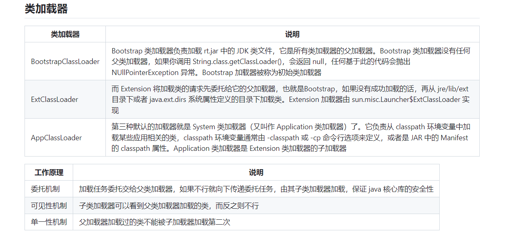

[toc]

## 精简版

类加载器分为启动类加载器，扩展类加载器和应用程序类加载器。

1. 启动类加载器负载加载JAVA的核心API是最基础的类库。
2. 扩展类加载器负载加载JAVA的扩展类，这是官方提供的一些有用的拓展功能：如，加密
3. 应用程序类加载器：加载我们自己的代码或第三方库代码。

类加载器工作流程（委托机制）：

1. 应用类加载器（`AppClassLoader`）会检查是否已经加载了这个类。如果没有，它会请求其父类加载器，即扩展类加载器（`ExtClassLoader`），尝试加载。
2. 扩展类加载器同样会向上委托给引导类加载器（`BootstrapClassLoader`）。
3. 如果引导类加载器无法加载这个类（通常因为它只加载Java的核心库），控制权回传给扩展类加载器，如果扩展类加载器也无法加载，则最终由应用类加载器尝试从classpath指定的位置加载这个类。

特性：

1. 委托机制造就了单一性原理：因为委托加载机制，对于多个类加载器请求加载的同一个类文件，实际上是一个共有的父加载器赢得加载权，因此不会重复加载。

2. 可见性：子类可以访问父类加载器加载的类，父类无法访问下层。主要是用于：实现类隔离和访问控制（核心类不依赖于应用程序类，而应用程序类依赖于核心类。因此核心类不需要看见应用程序类）

   



## 1.类加载器种类

类加载器通常分为启动类加载器（Bootstrap ClassLoader）、扩展类加载器（Extension ClassLoader）和应用程序类加载器（Application ClassLoader）。

我不理解啊，这些是什么鬼啊？


1. **启动类加载器（Bootstrap ClassLoader）**：负责加载Java的核心API，这些都是JDK自带的、最基本的类库，对于任何Java应用都是必需的。
2. **扩展类加载器（Extension ClassLoader）**：用于加载Java的扩展库，这些库通常不是编写Java应用时必需的，但提供了一些有用的附加功能，比如加密、各种网络协议支持等。
3. **应用程序类加载器（Application ClassLoader）**：这是直接与我们编写的Java应用交互最多的类加载器。它负责加载我们自己的代码以及添加到项目中的第三方库。


这好像内核啊，内核的核心子系统，然后动态加载的驱动，最后是我们要去处理的应用程序代码。


## 2.类加载器的工作原理

Java类加载器的核心职责是将类的字节码加载到Java虚拟机中。类加载器不仅负责加载类，还负责将类的字节码转换成运行时数据结构，并在内存中创建`java.lang.Class`对象。

### 类加载器的基本工作流程

类加载器的工作可以分为三个基本步骤：加载、链接、初始化。

1. **加载**

   - **读取**：类加载器从文件系统、网络或其他源读取指定类的字节码文件。
   - **转换**：字节码被转换成方法区中的运行时数据结构。
   - **创建**：在堆上为类对象（`java.lang.Class`对象）创建一个实例，代表这个类。

   总结来说：类的元数据（包括静态变量和字节码等）存储在方法区中，而每个类的`Class`对象实例存储在堆上

2. **链接**

   - **验证**：确保被加载类的正确性，检查字节码的格式等。
   - **准备**：为类变量分配内存，并设置默认初始值。
   - **解析**：将类、接口、字段和方法的符号引用转换为直接引用。

   提醒：这里其实是为类的实例变量分配空间。

3. **初始化**

   - **执行静态代码块**：执行静态初始化器和静态初始化块。

### 委托模型（Delegation Model）

类加载器使用委托模型来确保Java应用的安全性和类加载机制的正确性。这个模型要求类加载器在尝试自己加载类之前，先委托给其父类加载器进行加载。

- 例子

  假设我们有一个Java应用，它需要加载一个名为

  ```
  com.example.MyClass
  ```

  的类。

  - 首先，应用类加载器（`AppClassLoader`）会检查是否已经加载了这个类。如果没有，它会请求其父类加载器，即扩展类加载器（`ExtClassLoader`），尝试加载。
  - 扩展类加载器同样会向上委托给引导类加载器（`BootstrapClassLoader`）。
  - 如果引导类加载器无法加载这个类（通常因为它只加载Java的核心库），控制权回传给扩展类加载器，如果扩展类加载器也无法加载，则最终由应用类加载器尝试从classpath指定的位置加载这个类。

### 可见性和单一性原理

- **可见性**保证了子类加载器可以访问父类加载器加载的类，这意味着在类加载器的层次结构中，下层的类加载器可以看到上层加载器加载的类。
- **单一性**则确保了每个类在JVM中只被加载一次，即使有多个类加载器请求加载同一个类文件，由于委托模型，最顶层的成功加载该类的类加载器会“赢得”加载权，其它类加载器将不会重复加载。


### 总结:

单一性原理：因为委托加载机制，对于多个类加载器请求加载的同一个类文件，实际上是一个共有的父加载器赢得加载权，因此不会重复加载。

可见性：子类可以访问父类加载器加载的类，父类无法访问下层。主要是用于：实现类隔离和访问控制


### 示例：加载一个简单的Java类

假设我们有一个Java类叫做`com.example.MyClass`，它位于文件`MyClass.java`中。此类只包含一个简单的方法`print()`，用于打印一条消息。

```java
package com.example;

public class MyClass {
    public void print() {
        System.out.println("Hello from MyClass!");
    }
}
```

### 类加载过程

#### 1. 加载

- **动作**：当Java程序需要使用`com.example.MyClass`时（比如通过`new MyClass().print()`调用），JVM将指示类加载器去加载`MyClass`。
- **首次尝试**：首先，应用类加载器（`AppClassLoader`）会检查是否已经加载了这个类。如果没加载，才会进行委托机制。
- **委托机制**：应用类加载器会委托给其父类加载器（扩展类加载器，`ExtClassLoader`）尝试加载这个类。扩展类加载器进一步委托给引导类加载器（`BootstrapClassLoader`）。
- **查找与加载**：如果引导类加载器和扩展类加载器都找不到这个类（通常因为它们加载JRE的核心库和扩展库，而不加载应用级的类），控制权会回到应用类加载器。
- **加载类**：应用类加载器将在其类路径（`CLASSPATH`环境变量指定的路径，通常包括`.class`文件或`.jar`文件所在的目录）中查找`MyClass.class`文件。如果找到，它将读取该文件并将该类的字节码载入JVM。

#### 2. 链接

- **验证**：确保被加载类的正确性，检查字节码的格式等。
- **准备**：为类变量分配内存，并设置默认初始值。
- **解析**：将类、接口、字段和方法的符号引用转换为直接引用。

#### 3. 初始化

- **执行静态代码块**：执行类中的静态初始化块和静态字段初始化器，设置静态字段的最终值。

### 类使用

- 当类加载完成后，`new MyClass().print()`调用可以成功执行，`MyClass`的实例将被创建，并调用其`print`方法打印消息。

### 示例说明的关键点

- **委托机制**：确保类加载的请求首先由父类加载器处理，以维护Java平台的核心类库的安全。
- **可见性原理**：应用类加载器可以看到由父类加载器加载的所有类，反之则不行。
- **单一性原理**：一旦某个类加载器加载了`MyClass`，同一个类加载器及其所有子类加载器将不再尝试重新加载它。