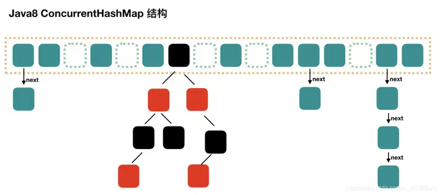

[toc]

## 精简版

1. 集合框架，也就是各种集合类，这里主要包括：Collection和Map。Collection是存放单一元素，Map存放键值对。

   1. Collection包含List，set，queue，我对他们的理解是：List是动态数组（可扩展长度），set是不允许重复元素的集合。Queue是操作受限的链表或数组，也就是队列和栈的集合。
   2. Map：哈希表是存储键值对的集合，每个键最多只能映射到一个值。且键值唯一。（因为其本质是根据键找到值，所以键值对要唯一）。

2. HashMap：

   1. 在JDK1.7中HashMap是数组+链表实现（哈希桶对应一个链表）。但是其最差情况下时间复杂度为O(n)，当数据较多时，效率下降。因此JDK1.8中，当链表数据较多时会被更新为红黑树，提高查找效率到O(logN)；
   2. HashMap 是非同步的，因此不是线程安全，但是性能更好，同时其可以接受为 null 的 key-value，而 Hashtable 是线程安全的，比 HashMap 要慢，不接受 null 的 key-value。目前HashTable已经被淘汰，可以用ConCurrentHashMap（并发hashmap）替代。

3. ConCurrentMap：

   1. 1.7版本中ConcurrentHashMap是一个逻辑上的空间，实际上由多个独立的HashMap：内部称作Segment组成，它们每个都有属于自己的独立的锁（分段锁）以及锁策略。

      然后put时，就是获取哈希值，将哈希值的高 N 位对 Segment 个数取模从而得到该 Key 应该属于哪个Segment，接着如同操作 HashMap 一样操作这个 Segment。

      1. 读操作：不需要加锁，使用了 `volatile` 关键字和 `Unsafe` 类相关的方法来直接操作内存，确保每次读取到的都是最新数据。
      2. 写操作：只锁定必要的 Segment，而不是整个 Map。这样，即使在写入时，其他 Segment 的读写操作也不会被阻塞。
      3. 锁策略：使用自旋锁尝试获取锁，在高竞争环境下，如果自旋失败（通常是预设的次数），它会退回到互斥锁。

   2. 1.8版本相对于1.7版本抛弃了Segment，转而将每个bucket视作锁的单元（细粒度锁）。每次只有写操作时才会对对应的bucket上锁。同时如果某个桶中的链表长度超过一定阈值（默认为 8），那么链表会被转换为红黑树，从而提高长链表的查找效率。

## 1. 集合框架

集合框架，也就是各种集合类，这里主要包括：Collection和Map。Collection是存放单一元素，Map存放键值对。

### 集合框架概述

Java 集合框架主要由两大部分组成：`Collection` 和 `Map` 接口及其实现。

#### 1. Collection 接口

`Collection` 是最基本的集合接口，它有几个重要的子接口：

- **List**：有序集合（也称为序列）。此接口的用户可以精确控制列表中每个元素的插入位置。用户可以通过整数索引（在列表中的位置）访问元素，并搜索元素。典型的实现有 `ArrayList` 和 `LinkedList`。
- **Set**：不允许重复元素的集合。`Set` 不保证维护元素的添加顺序。`HashSet`、`LinkedHashSet`（保持元素的插入顺序），和 `TreeSet`（按自然顺序或自定义比较器排序）是这个接口的常见实现。
- **Queue**：队列通常用于在处理前保持元素。它提供了额外的插入、提取和检查操作。队列通常（但不一定）以 FIFO（先进先出）方式排序元素。比如 `LinkedList` 和 `PriorityQueue`。

我对他们的理解是：List是动态数组，set是不允许重复元素的集合。Queue是操作受限的链表或数组，也就是队列和栈的集合。

#### 2. Map 接口

- `Map` 存储键值对的集合，每个键最多只能映射到一个值。这是一种使用键（key）访问数据的模型，键是唯一的，每个键映射到一个具体的值。`HashMap` 是最常用的实现，它基于哈希表实现。其他的实现如 `TreeMap`（按照键的自然顺序或自定义的顺序来排序），和 `LinkedHashMap`（按插入顺序或最近最少使用（LRU）顺序维护元素）。

### 集合框架的设计原则

集合框架的设计提供了高效的数据结构和算法，目的是最大限度地提高性能，减少编程工作量。每种集合接口和实现都有其特定的用例：

- **List**：当需要按插入顺序存储和访问数据时使用。
- **Set**：当需要维护不重复的元素集合时使用。
- **Queue**：当需要在多线程环境中或者在数据结构如先进先出（FIFO）模型中处理数据时使用。
- **Map**：当需要通过键快速访问数据时使用。

每个接口的实现都优化了某些特定的操作，因此在选择合适的实现时需要考虑具体的应用需求。

## 2. HashMap

### HashMap 结构变化

您提到了 JDK 1.7 和 JDK 1.8 中 `HashMap` 的结构图，但没有具体描述。这里我补充一下两者的区别：

- **JDK 1.7**: `HashMap` 内部使用 **数组 + 链表** 的结构。每个数组的槽点（bucket）引用链表的头节点。当多个元素通过哈希函数映射到同一个槽点时，会发生哈希冲突，这些元素以链表形式存储。
- **JDK 1.8**: 为了提高冲突时的查找效率，`HashMap` 在链表长度超过一定阈值（默认为8）时，链表会转换为红黑树。这减少了最坏情况下的时间复杂度从 `O(n)` 到 `O(log n)`。

### HashMap 的工作原理

HashMap 基于 hashing 原理，我们通过 put() 和 get() 方法储存和获取对象。

当我们将键值对传递给 put() 方法时，它调用键对象的 hashCode() 方法来计算 hashcode，让后找到 bucket 位置来储存 Entry 对象。当两个对象的 hashcode 相同时，它们的 bucket 位置相同，‘碰撞’会发生。因为 HashMap 使用链表存储对象，这个 Entry 会存储在链表中，当获取对象时，通过键对象的 equals() 方法找到正确的键值对，然后返回值对象。

那get（）方法的原理呢？通过键对象的hashCode找到对应的桶bucket，然后在桶中遍历，用键的equals方法找到正确的键值对，最后返回值？

### HashMap的注意事项

这里强调几个关键点：

1. **哈希函数**: `HashMap` 通过哈希函数将键对象映射到桶数组的一个索引上。这个函数尝试分散不同的键到不同的桶上，以减少碰撞。
2. **处理哈希冲突**: 通过链表（或在 JDK 1.8 及以上版本中的红黑树）处理在同一个桶内的冲突。如果两个键的哈希值相同，它们会存储在同一个桶的链表（或红黑树）中。
3. **负载因子和容量**: 负载因子是衡量 `HashMap` 装满程度的一个参数，其默认值是 0.75。这是时间和空间成本的一个折中：较低的负载因子减少了冲突但增加了数组的空间消耗，而较高的负载因子增加了冲突的可能性但使用空间更为经济。

### HashMap 与 HashTable 对比

HashMap 是非 synchronized 的，性能更好，HashMap 可以接受为 null 的 key-value，而 Hashtable 是线程安全的，比 HashMap 要慢，不接受 null 的 key-value。

#### 使用建议

- **`Hashtable`**：由于它的设计已经较为过时，且有更好的替代品（如 `ConcurrentHashMap`），通常不推荐在新的开发中使用 `Hashtable`。如果你需要线程安全的映射并且 JDK 版本允许，考虑使用 `ConcurrentHashMap`，它提供了更好的并发性能。
- **`HashMap`**：适用于单线程环境或可以管理外部同步的多线程环境中。它的性能优于 `Hashtable`。

## 3. ConcurrentHashMap

### JDK 1.7

原理：

其实就是1.7版本中ConcurrentHashMap是一个逻辑上的空间，实际上由多个独立的HashMap：即Segment组成，它们每个都有属于自己的独立的锁（分段锁）以及锁策略。

然后put时，就是获取哈希值，将哈希值的高 N 位对 Segment 个数取模从而得到该 Key 应该属于哪个Segment，接着如同操作 HashMap 一样操作这个 Segment。

#### 其读操作：

由于读取操作不需要加锁（大多数情况下），所以读取操作非常快。在读取时，为保证可见性，使用了 `volatile` 关键字和 `Unsafe` 类相关的方法来直接操作内存，确保每次读取到的都是最新数据。

#### 其写操作：

对于写操作，`ConcurrentHashMap` 只锁定必要的 Segment，而不是整个 Map。这样，即使在写入时，其他 Segment 的读写操作也不会被阻塞。

#### 锁策略：

`ConcurrentHashMap` 使用自旋锁尝试获取锁，在高竞争环境下，如果自旋失败（通常是预设的次数），它会退回到互斥锁。这种策略是基于自旋锁在等待短时间时效率较高的考虑，但为了避免长时间占用 CPU，当自旋次数过多时采用标准的互斥锁。

### JDK1.8

JDK1.8抛弃了Segment，转而将每个bucket视作锁的单元（细粒度锁）。每次只有写操作时才会对对应的bucket上锁。同时如果某个桶中的链表长度超过一定阈值（默认为 8），那么链表会被转换为红黑树，从而提高长链表的查找效率。

#### 锁定和写操作

- 写操作锁定
  - 在 JDK 1.8 中，每次写操作（如 `put` 和 `remove`）只锁定需要修改的具体桶，而不是整个 `ConcurrentHashMap`。这样做减少了写操作之间的锁争用，允许更多的并发写操作同时进行。
- 读操作优化
  - 读操作通常是无锁的，只有在节点内容发生变化时（如在转换链表为红黑树时），才需要通过锁来保证一致性和可见性。即使在读取时，由于 `volatile` 关键字的使用，大多数读取都能直接从内存中获取最新值。

### 源码分析

