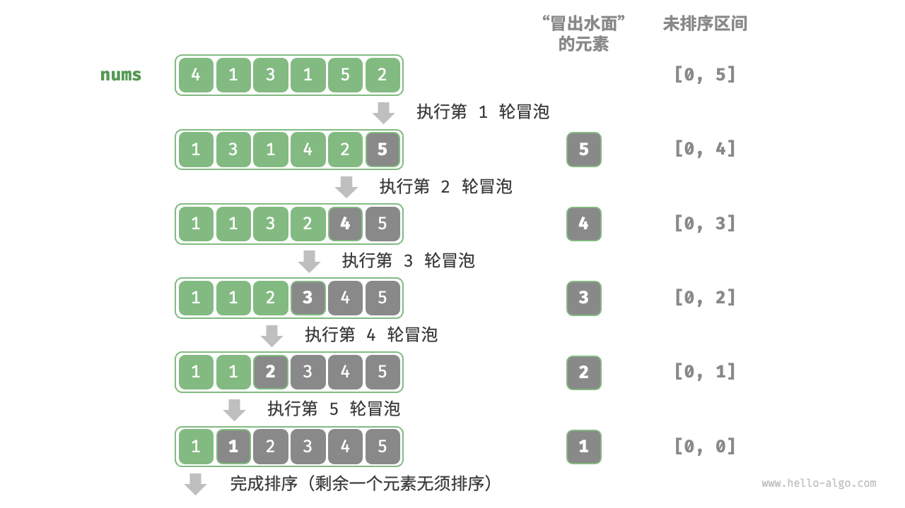

[toc]

## 1.冒泡排序

冒泡排序（bubble sort）通过连续地比较与交换相邻元素实现排序。这个过程就像气泡从底部升到顶部一样，因此得名冒泡排序。

关键逻辑：对未排序区间从[0，n-1]到区间[0,1]进行循环执行，每次在未排序区间内部找到最大元素交换至该区间的最右端。每次执行完后，排序区间元素便会减少1.

冒泡过程可以利用元素交换操作来模拟：从数组最左端开始向右遍历，依次比较相邻元素大小，如果“左元素 > 右元素”就交换二者。遍历完成后，最大的元素会被移动到数组的最右端。

### 1.1 算法流程

设数组的长度为 𝑛 ，冒泡排序的步骤如图 11-5 所示。

1. 首先，对 𝑛 个元素执行“冒泡”，**将数组的最大元素交换至正确位置**。
2. 接下来，对剩余 𝑛−1 个元素执行“冒泡”，**将第二大元素交换至正确位置**。
3. 以此类推，经过 𝑛−1 轮“冒泡”后，**前 𝑛−1 大的元素都被交换至正确位置**。
4. 仅剩的一个元素必定是最小元素，无须排序，因此数组排序完成。

[](https://www.hello-algo.com/chapter_sorting/bubble_sort.assets/bubble_sort_overview.png)

示例代码：

```java
/* 冒泡排序 */
void bubbleSort(int[] nums) {
    // 外循环：未排序区间为 [0, i]
    for (int i = nums.length - 1; i > 0; i--) {
        // 内循环：将未排序区间 [0, i] 中的最大元素交换至该区间的最右端
        for (int j = 0; j < i; j++) {
            if (nums[j] > nums[j + 1]) {
                // 交换 nums[j] 与 nums[j + 1]
                int tmp = nums[j];
                nums[j] = nums[j + 1];
                nums[j + 1] = tmp;
            }
        }
    }
}
```

### 1.2 效率优化

我们发现，如果某轮“冒泡”中没有执行任何交换操作，说明数组已经完成排序，可直接返回结果。因此，可以增加一个标志位 `flag` 来监测这种情况，一旦出现就立即返回。

经过优化，冒泡排序的最差时间复杂度和平均时间复杂度仍为 𝑂(𝑛2) ；但当输入数组完全有序时，可达到最佳时间复杂度 𝑂(𝑛) 。

```java
/* 冒泡排序（标志优化） */
void bubbleSortWithFlag(int[] nums) {
    // 外循环：未排序区间为 [0, i]
    for (int i = nums.length - 1; i > 0; i--) {
        boolean flag = false; // 初始化标志位
        // 内循环：将未排序区间 [0, i] 中的最大元素交换至该区间的最右端
        for (int j = 0; j < i; j++) {
            if (nums[j] > nums[j + 1]) {
                // 交换 nums[j] 与 nums[j + 1]
                int tmp = nums[j];
                nums[j] = nums[j + 1];
                nums[j + 1] = tmp;
                flag = true; // 记录交换元素
            }
        }
        if (!flag)
            break; // 此轮“冒泡”未交换任何元素，直接跳出
    }
}
```

### 1.3 算法特性

- **时间复杂度为 𝑂(𝑛2)、自适应排序**：各轮“冒泡”遍历的数组长度依次为 𝑛−1、𝑛−2、…、2、1 ，总和为 (𝑛−1)𝑛/2 。在引入 `flag` 优化后，最佳时间复杂度可达到 𝑂(𝑛) 。
- **空间复杂度为 𝑂(1)、原地排序**：指针 𝑖 和 𝑗 使用常数大小的额外空间。
- **稳定排序**：由于在“冒泡”中遇到相等元素不交换。


## 2.归并排序

归并排序（merge sort）是一种基于分治策略的排序算法，包含图 11-10 所示的“划分”和“合并”阶段。

1. **划分阶段**：通过递归不断地将数组从中点处分开，将长数组的排序问题转换为短数组的排序问题。
2. **合并阶段**：当子数组长度为 1 时终止划分，开始合并，持续地将左右两个较短的有序数组合并为一个较长的有序数组，直至结束。

[](https://www.hello-algo.com/chapter_sorting/merge_sort.assets/merge_sort_overview.png)


很简单，将其理解为后序遍历即可，先对左子树递归，再对右子树递归，最后是对根节点进行处理。这个处理是merge，将左右子树merge成一个根节点。

merge：构造一个临时数组，存放数据，然后写回原数组

### 2.1 算法流程

“划分阶段”从顶至底递归地将数组从中点切分为两个子数组。

1. 计算数组中点 `mid` ，递归划分左子数组（区间 `[left, mid]` ）和右子数组（区间 `[mid + 1, right]` ）。
2. 递归执行步骤 `1.` ，直至子数组区间长度为 1 时终止。

“合并阶段”从底至顶地将左子数组和右子数组合并为一个有序数组。需要注意的是，从长度为 1 的子数组开始合并，合并阶段中的每个子数组都是有序的。


观察发现，归并排序与二叉树后序遍历的递归顺序是一致的。

- **后序遍历**：先递归左子树，再递归右子树，最后处理根节点。
- **归并排序**：先递归左子数组，再递归右子数组，最后处理合并。

归并排序的实现如以下代码所示。请注意，`nums` 的待合并区间为 `[left, right]` ，而 `tmp` 的对应区间为 `[0, right - left]` 。

```java
/* 合并左子数组和右子数组 */
void merge(int[] nums, int left, int mid, int right) {
    // 左子数组区间为 [left, mid], 右子数组区间为 [mid+1, right]
    // 创建一个临时数组 tmp ，用于存放合并后的结果
    int[] tmp = new int[right - left + 1];
    // 初始化左子数组和右子数组的起始索引
    int i = left, j = mid + 1, k = 0;
    // 当左右子数组都还有元素时，进行比较并将较小的元素复制到临时数组中
    while (i <= mid && j <= right) {
        if (nums[i] <= nums[j])
            tmp[k++] = nums[i++];
        else
            tmp[k++] = nums[j++];
    }
    // 将左子数组和右子数组的剩余元素复制到临时数组中
    while (i <= mid) {
        tmp[k++] = nums[i++];
    }
    while (j <= right) {
        tmp[k++] = nums[j++];
    }
    // 将临时数组 tmp 中的元素复制回原数组 nums 的对应区间
    for (k = 0; k < tmp.length; k++) {
        nums[left + k] = tmp[k];
    }
}

/* 归并排序 */
void mergeSort(int[] nums, int left, int right) {
    // 终止条件
    if (left >= right)
        return; // 当子数组长度为 1 时终止递归
    // 划分阶段
    int mid = (left + right) / 2; // 计算中点
    mergeSort(nums, left, mid); // 递归左子数组
    mergeSort(nums, mid + 1, right); // 递归右子数组
    // 合并阶段
    merge(nums, left, mid, right);
}
```

### 2.2 算法特性

- **时间复杂度为 𝑂(𝑛log⁡𝑛)、非自适应排序**：划分产生高度为 log⁡𝑛 的递归树，每层合并的总操作数量为 𝑛 ，因此总体时间复杂度为 𝑂(𝑛log⁡𝑛) 。
- **空间复杂度为 𝑂(𝑛)、非原地排序**：递归深度为 log⁡𝑛 ，使用 𝑂(log⁡𝑛) 大小的栈帧空间。合并操作需要借助辅助数组实现，使用 𝑂(𝑛) 大小的额外空间。
- **稳定排序**：在合并过程中，相等元素的次序保持不变。

### 2.3 链表排序

对于链表，归并排序相较于其他排序算法具有显著优势，**可以将链表排序任务的空间复杂度优化至 𝑂(1)** 。

- **划分阶段**：可以使用“迭代”替代“递归”来实现链表划分工作，从而省去递归使用的栈帧空间。
- **合并阶段**：在链表中，节点增删操作仅需改变引用（指针）即可实现，因此合并阶段（将两个短有序链表合并为一个长有序链表）无须创建额外链表。

具体实现细节比较复杂，有兴趣的读者可以查阅相关资料进行学习。


这仍然是递归的方式

这里需要return merge后的头结点，这是因为链表不是数组，不支持直接访问，因此需要传递头结点（左右子树的起始位置）

```java
/**
 * Definition for singly-linked list.
 * public class ListNode {
 *     int val;
 *     ListNode next;
 *     ListNode() {}
 *     ListNode(int val) { this.val = val; }
 *     ListNode(int val, ListNode next) { this.val = val; this.next = next; }
 * }
 */
class Solution {   
    private ListNode merge(ListNode l1, ListNode l2) {
        ListNode dummy = new ListNode(0);
        ListNode curr = dummy;

        while (l1 != null && l2 != null) {
            if (l1.val <= l2.val) {
                curr.next = l1;
                l1 = l1.next;
            } else {
                curr.next = l2;
                l2 = l2.next;
            }
            curr = curr.next;
        }
        curr.next = (l1 == null) ? l2 : l1;

        return dummy.next;
    }
     public ListNode sortList(ListNode head) {
        if (head == null || head.next == null) {    //终止条件
            return head;//注意这个return
        }

        ListNode fast = head;
        ListNode slow = head;
        ListNode prev = null;	//用于断开连接

        while ( fast != null && fast.next != null) {    //快慢指针，找到中点
            prev = slow;
            slow = slow.next;
            fast = fast.next.next;           
        }
        prev.next = null;
        ListNode left  = sortList(head);
        ListNode right = sortList(slow);

        return merge(left, right);//注意这个return
    }
}
```

迭代的方式

```java
/**
 * Definition for singly-linked list.
 * public class ListNode {
 *     int val;
 *     ListNode next;
 *     ListNode() {}
 *     ListNode(int val) { this.val = val; }
 *     ListNode(int val, ListNode next) { this.val = val; this.next = next; }
 * }
 */
class Solution {
    public ListNode sortList(ListNode head) {
        if (head == null || head.next ==null) {
            return head;
        }

        int length = getLength(head);
        ListNode dummy = new ListNode(0);//保护措施
        dummy.next = head;

        for (int size = 1; size < length; size *= 2) {//第一次分，最小化链表长度为1，第二次为2，第三次为4.
            ListNode prev = dummy;//不懂
            ListNode curr = dummy.next;//不懂

            while (curr != null) {//遍历链表
                ListNode left = curr;
                ListNode right = split(left, size);//获得左子树
                curr = split(right, size);//获得右子树
                prev = merge(left, right, prev);//合并左右子树，返回
            }
        }

        return dummy.next;
    }
    private int getLength(ListNode head) {
        int length = 0;

        while (head != null) {
            length++;
            head = head.next;
        }
        return length;
    }
    private ListNode split(ListNode head, int size) {
        if (head == null) {
            return null;
        }
        for (int i = 1; i < size && head.next!= null; i++) {
            head = head.next;
        }
        ListNode right = head.next;	//拆分链表
        head.next = null;
        return right;
    }
    private ListNode merge(ListNode l1, ListNode l2, ListNode prev) {
        ListNode curr = prev;
        while (l1 != null && l2 !=null) {
            if (l1.val <= l2.val) {
                curr.next = l1;
                l1 = l1.next;
            } else {
                curr.next = l2;
                l2 = l2.next;
            }
            curr = curr.next;
        }
        curr.next = (l1 != null) ? l1 : l2;
        while (curr.next != null) {//找到结束位置
            curr = curr.next;
        }
        return curr;//返回合并后的结束位置，即：下一次合并的起始位置。
    }
}
```


## 3.快速排序

快速排序（quick sort）是一种基于分治策略的排序算法，运行高效，应用广泛。

快速排序的核心操作是“哨兵划分”，其目标是：选择数组中的某个元素作为“基准数”，将所有小于基准数的元素移到其左侧，而大于基准数的元素移到其右侧。

具体来说，哨兵划分的流程如图 11-8 所示。

1. 选取数组最左端元素作为基准数，初始化两个指针 `i` 和 `j` 分别指向数组的两端。
2. 设置一个循环，在每轮中使用 `i`（`j`）分别寻找第一个比基准数大（小）的元素，然后交换这两个元素。
3. 循环执行步骤 `2.` ，直到 `i` 和 `j` 相遇时停止，最后将基准数交换至两个子数组的分界线。


很简单，将其理解为前序遍历即可，先处理根节点，后递归处理左右子树节点。这个处理是partition，将左右子树隔开成小于根节点和大于根节点。

这里的partition将左子树变为小于根节点，右子树变为大于根节点，然后返回根节点。

```java
private void swap(int[] nums, int i, int j) {
    int temp = nums[i];
    nums[i]  = nums[j];
    nums[j]  = temp;
}
private int partition(int[] nums, int left, int right) {
    int i = left, j = right;
    while (i < j) {
        while (i < j && nums[j] >= nums[left]) {
            j--;
        }
        while (i < j && nums[i] <= nums[left]) {
            i++;
        }
        swap(nums, i, j);
    }
    swap(nums, i, left);

    return i;
}
private void quickSort(int[] nums, int left, int right) {
    if (left >= right) {
        return;
    }
    int pivot = partition(nums, left, right);
    quickSort(nums, left, pivot-1);
    quickSort(nums, pivot+1, right);
}
```

缺少：基准数优化。

### 算法特性

- **时间复杂度为 𝑂(𝑛log⁡𝑛)、自适应排序**：在平均情况下，哨兵划分的递归层数为 log⁡𝑛 ，每层中的总循环数为 𝑛 ，总体使用 𝑂(𝑛log⁡𝑛) 时间。在最差情况下，每轮哨兵划分操作都将长度为 𝑛 的数组划分为长度为 0 和 𝑛−1 的两个子数组，此时递归层数达到 𝑛 ，每层中的循环数为 𝑛 ，总体使用 𝑂(𝑛2) 时间。
- **空间复杂度为 𝑂(𝑛)、原地排序**：在输入数组完全倒序的情况下，达到最差递归深度 𝑛 ，使用 𝑂(𝑛) 栈帧空间。排序操作是在原数组上进行的，未借助额外数组。
- **非稳定排序**：在哨兵划分的最后一步，基准数可能会被交换至相等元素的右侧。

### 快速排序为什么快

从名称上就能看出，快速排序在效率方面应该具有一定的优势。尽管快速排序的平均时间复杂度与“归并排序”和“堆排序”相同，但通常快速排序的效率更高，主要有以下原因。

- **出现最差情况的概率很低**：虽然快速排序的最差时间复杂度为 𝑂(𝑛2) ，没有归并排序稳定，但在绝大多数情况下，快速排序能在 𝑂(𝑛log⁡𝑛) 的时间复杂度下运行。
- **缓存使用效率高**：在执行哨兵划分操作时，系统可将整个子数组加载到缓存，因此访问元素的效率较高。而像“堆排序”这类算法需要跳跃式访问元素，从而缺乏这一特性。
- **复杂度的常数系数小**：在上述三种算法中，快速排序的比较、赋值、交换等操作的总数量最少。这与“插入排序”比“冒泡排序”更快的原因类似。


### 基准数优化

**快速排序在某些输入下的时间效率可能降低**。举一个极端例子，假设输入数组是完全倒序的，由于我们选择最左端元素作为基准数，那么在哨兵划分完成后，基准数被交换至数组最右端，导致左子数组长度为 𝑛−1、右子数组长度为 0 。如此递归下去，每轮哨兵划分后都有一个子数组的长度为 0 ，分治策略失效，快速排序退化为“冒泡排序”的近似形式。

为了尽量避免这种情况发生，**我们可以优化哨兵划分中的基准数的选取策略**。例如，我们可以随机选取一个元素作为基准数。然而，如果运气不佳，每次都选到不理想的基准数，效率仍然不尽如人意。

需要注意的是，编程语言通常生成的是“伪随机数”。如果我们针对伪随机数序列构建一个特定的测试样例，那么快速排序的效率仍然可能劣化。

为了进一步改进，我们可以在数组中选取三个候选元素（通常为数组的首、尾、中点元素），**并将这三个候选元素的中位数作为基准数**。这样一来，基准数“既不太小也不太大”的概率将大幅提升。当然，我们还可以选取更多候选元素，以进一步提高算法的稳健性。采用这种方法后，时间复杂度劣化至 𝑂(𝑛2) 的概率大大降低。

示例代码如下：

其实就是添加了一个三个候选元素中选取中间值，然后交换到数组最左端，其余跟上面保持一致。

```java
/* 选取三个候选元素的中位数 */
int medianThree(int[] nums, int left, int mid, int right) {
    int l = nums[left], m = nums[mid], r = nums[right];
    if ((l <= m && m <= r) || (r <= m && m <= l))
        return mid; // m 在 l 和 r 之间
    if ((m <= l && l <= r) || (r <= l && l <= m))
        return left; // l 在 m 和 r 之间
    return right;
}

/* 哨兵划分（三数取中值） */
int partition(int[] nums, int left, int right) {
    // 选取三个候选元素的中位数
    int med = medianThree(nums, left, (left + right) / 2, right);
    // 将中位数交换至数组最左端
    swap(nums, left, med);
    // 以 nums[left] 为基准数
    int i = left, j = right;//注意哦，别自作聪明变成i = left + 1.
    while (i < j) {
        while (i < j && nums[j] >= nums[left])
            j--;          // 从右向左找首个小于基准数的元素
        while (i < j && nums[i] <= nums[left])
            i++;          // 从左向右找首个大于基准数的元素
        swap(nums, i, j); // 交换这两个元素
    }
    swap(nums, i, left);  // 将基准数交换至两子数组的分界线
    return i;             // 返回基准数的索引
}
```

### 尾递归优化

**在某些输入下，快速排序可能占用空间较多**。以完全有序的输入数组为例，设递归中的子数组长度为 𝑚 ，每轮哨兵划分操作都将产生长度为 0 的左子数组和长度为 𝑚−1 的右子数组，这意味着每一层递归调用减少的问题规模非常小（只减少一个元素），递归树的高度会达到 𝑛−1 ，此时需要占用 𝑂(𝑛) 大小的栈帧空间。

为了防止栈帧空间的累积，我们可以在每轮哨兵排序完成后，比较两个子数组的长度，**仅对较短的子数组进行递归**。由于较短子数组的长度不会超过 𝑛/2 ，因此这种方法能确保递归深度不超过 log⁡𝑛 ，从而将最差空间复杂度优化至 𝑂(log⁡𝑛) 。代码如下所示：

```java
/* 快速排序（尾递归优化） */
void quickSort(int[] nums, int left, int right) {
    // 子数组长度为 1 时终止
    while (left < right) {
        // 哨兵划分操作
        int pivot = partition(nums, left, right);
        // 对两个子数组中较短的那个执行快速排序
        if (pivot - left < right - pivot) {
            quickSort(nums, left, pivot - 1); // 递归排序左子数组
            left = pivot + 1; // 剩余未排序区间为 [pivot + 1, right]
        } else {
            quickSort(nums, pivot + 1, right); // 递归排序右子数组
            right = pivot - 1; // 剩余未排序区间为 [left, pivot - 1]
        }
    }
}
```

其本质是减少递归栈的长度

递归栈实际上就是函数嵌套调用的次数，递归栈深度On，就是指会嵌套调用On次函数。这里的迭代只用来处理较短数组，而较短数组最高的嵌套次数是logn。因此其总体递归栈长度是O logn


搞不懂
