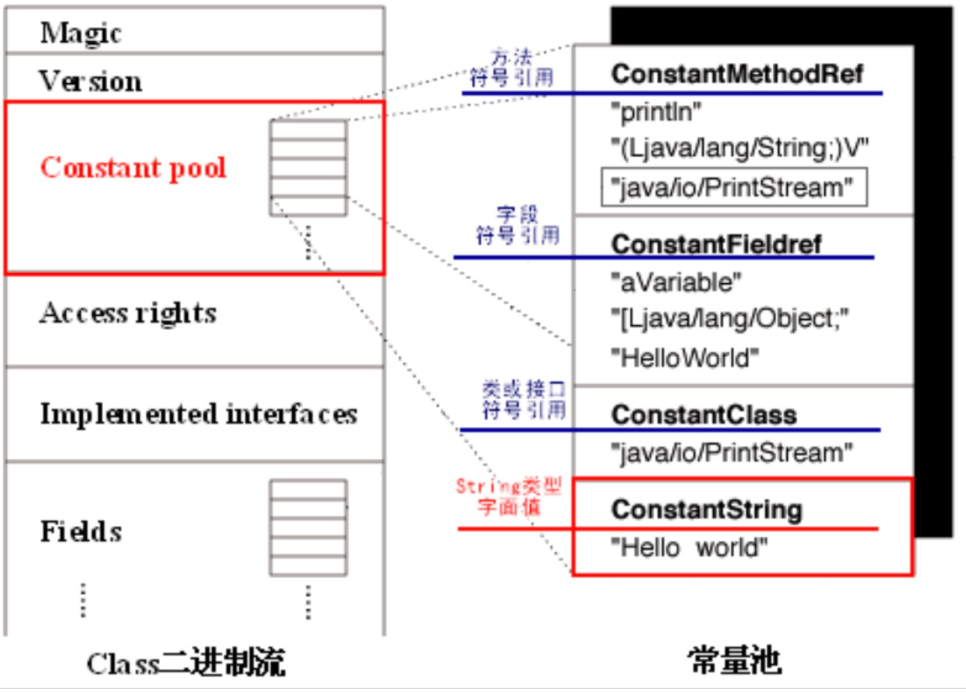
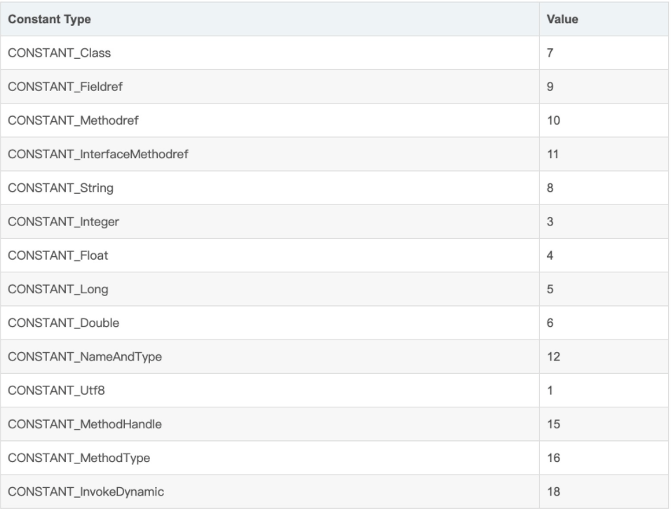

[toc]

## 1. 静态常量池


Java程序要运行时，需要编译器先将源代码文件编译成字节码（.class)文件，然后在由JVM解释执行。

class文件中除了有类的版本、字段、方法、接口等描述信息外,还有一项信息是常量池(Constant pool table)，用于存放编译期生成的各种字面量和符号引用，这部分内容将在类加载后进入运行时常量池中存放。

静态常量池就是上面说的class文件中的常量池。class常量池是在编译时每个class文件中都存在。不同的符号信息放置在不同标志的常量表中。



常量池中存放的符号信息，在JVM执行指令时需要依赖使用。常量池中的所有项都具有如下通用格式：

```
cp_info {
    u1 tag;     //表示cp_info的单字节标记位
    u1 info[];  //两个或更多的字节表示这个常量的信息，信息格式由tag的值确定
}
```

支持的类型信息如下：



以CONSTANT_Class为例，它用于表示类或者接口，格式如下：

```
CONSTANT_Class_info {
 u1 tag;       //这个值为CONSTANT_Class (7)
 u2 name_index;//一个index，表示一个索引，引用的是CONSTANT_UTF8_info
}
```

CONSTANT_Class_info类型是由一个tag和一个name_index组成。name_index中的index表示它是一个索引，引用的是CONSTANT_UTF8_info。

CONSTANT_Utf8_info用于表示字符常量的值，结构如下所示：

```
CONSTANT_Utf8_info {
 u1 tag;
 u2 length;
 u1 bytes[length];
}
```

tag表示为：CONSTANT_Utf8（1）；length指明了bytes[]数组的长度；bytes[]数组引用了上一个length作为其长度。字符常量采用改进过的UTF-8编码表示。

对于静态常量池我们需要知道它存在于编译器，如果说与运行时有关的话，可以说运行时中的常量是JVM加载class文件之后进行分配的。


## 运行时常量池

运行时常量池就是将编译后的类信息放入方法区中，也就是说它是方法区的一部分。


## 字符串常量池