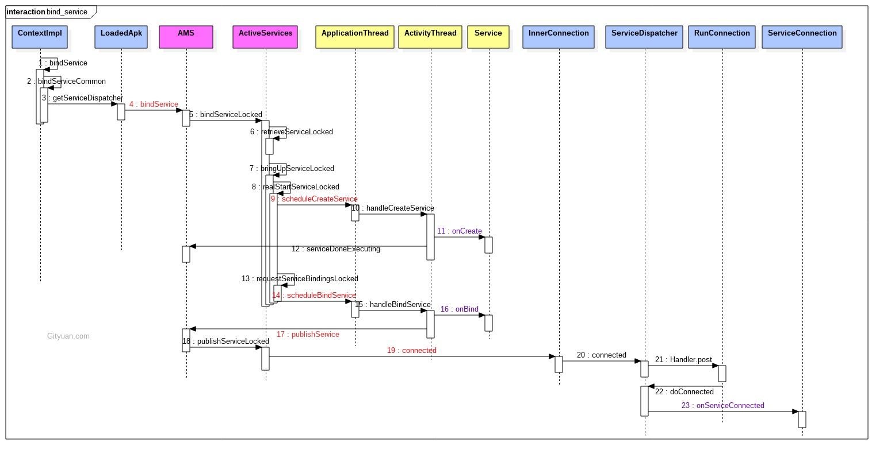
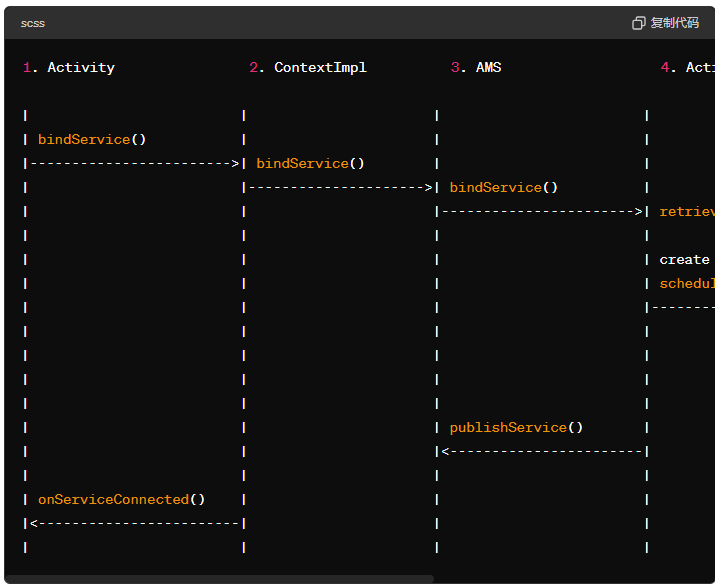
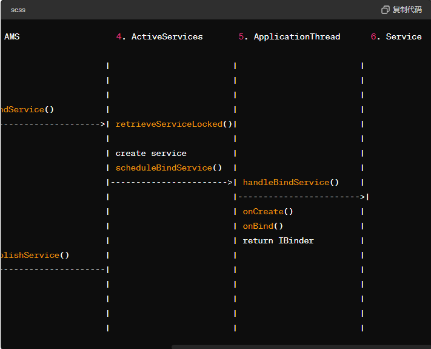

[toc]

## 绑定过程



### 理解整体概念

首先要了解大概的框架和整体流程，而不是试图一开始就记住所有的细节。通过阅读高层次的概述文档或教程，建立一个整体的理解框架。


### 绑定服务的浓缩框架和流程

#### 1. 概览

绑定服务（Bound Service）的主要目的是允许客户端（如Activity）与服务进行交互，并保持连接，以便可以调用服务中的方法。绑定服务通过返回一个 `IBinder` 接口供客户端使用。

#### 2. 流程图解





#### 3. 详细步骤

1. **Activity 调用 `bindService` 方法**

   - **作用**：发起绑定服务的请求。
   - **代码**：`bindService(intent, serviceConnection, Context.BIND_AUTO_CREATE);`

2. **ContextImpl 处理 `bindService` 请求**

   - **作用**：将绑定请求传递给 `AMS`（ActivityManagerService）。

   - 代码

     ：

     ```
     @Override
     public boolean bindService(Intent service, ServiceConnection conn, int flags) {
         // 传递请求到AMS
         return ActivityManager.getService().bindService(...);
     }
     ```

3. **AMS 处理 `bindService` 请求**

   - **作用**：AMS 接收请求，开始处理服务绑定逻辑，可能需要创建新的服务实例。

   - 代码

     ：

     ```java
     public boolean bindService(...) {
         // 调用内部方法处理绑定请求
         return mServices.bindServiceLocked(...);
     }
     ```

4. **ActiveServices 创建或检索服务实例**

   - **作用**：如果服务未启动，创建服务实例并启动服务进程；如果服务已启动，直接绑定服务。

   - 代码

     ：

     ```java
     public Service retrieveServiceLocked(...) {
         // 创建或检索服务实例
         return new Service();
     }
     ```

5. **ApplicationThread 调用 `handleBindService` 方法**

   - **作用**：将服务的绑定请求调度到 `ActivityThread` 进行处理。

   - 代码

     ：

     ```
     public void handleBindService(...) {
         // 调用服务的onBind方法
         IBinder binder = service.onBind(intent);
         // 返回IBinder对象
         return binder;
     }
     ```

6. **Service 返回 `IBinder` 对象**

   - **作用**：服务实例调用 `onBind` 方法，返回一个 `IBinder` 对象，供客户端使用。

   - 代码

     ：

     ```
     @Override
     public IBinder onBind(Intent intent) {
         return binder; // 返回IBinder对象
     }
     ```

7. **AMS 将 `IBinder` 对象传递给客户端**

   - **作用**：通过 `publishService` 方法，将 `IBinder` 对象传递给客户端。

   - 代码

     ：

     ```java
     public void publishService(...) {
         // 将IBinder对象传递给客户端
     }
     ```

8. **客户端接收并使用 `IBinder` 对象**

   - **作用**：客户端的 `ServiceConnection` 回调 `onServiceConnected` 方法，接收 `IBinder` 对象，并可通过它与服务交互。

   - 代码

     ：

     ```java
     @Override
     public void onServiceConnected(ComponentName name, IBinder service) {
         MyService.LocalBinder binder = (MyService.LocalBinder) service;
         myService = binder.getService();
     }
     ```

### 关键点总结

- **Activity 发起绑定请求**：通过调用 `bindService` 方法。
- **ContextImpl 处理请求**：将请求传递给 `AMS`。
- **AMS 管理绑定过程**：决定是创建新服务实例还是使用已有实例。
- **ActivityThread 调用服务方法**：处理服务的 `onCreate` 和 `onBind` 方法。
- **服务返回 `IBinder` 对象**：供客户端使用。
- **客户端接收 `IBinder`**：通过 `ServiceConnection` 的 `onServiceConnected` 方法，使用 `IBinder` 对象与服务进行交互。


## ActivityThread

```
private void handleBindService(BindServiceData data) {
    Service s = mServices.get(data.token);
    ···
    if (s != null) {
        try {
            data.intent.setExtrasClassLoader(s.getClassLoader());
            data.intent.prepareToEnterProcess();
            try {
                if (!data.rebind) {
                    IBinder binder = s.onBind(data.intent);
                    ActivityManager.getService().publishService(
                            data.token, data.intent, binder);
                } else {
                    s.onRebind(data.intent);
                    ActivityManager.getService().serviceDoneExecuting(
                            data.token, SERVICE_DONE_EXECUTING_ANON, 0, 0);
                }
            } catch (RemoteException ex) {
                throw ex.rethrowFromSystemServer();
            }
        } 
        ···
    }
}
```

### `handleBindService` 方法详解

`handleBindService` 方法是 `ActivityThread` 类的一部分，它处理服务绑定请求。在此过程中，它会调用服务的 `onBind` 方法，并将返回的 `IBinder` 对象传递回 `ActivityManagerService` (AMS)。

#### 方法签名

```
java复制代码private void handleBindService(BindServiceData data) {
    Service s = mServices.get(data.token);
    ...
}
```

#### 方法步骤解析

1. **获取服务实例**：

   ```
   java
   复制代码
   Service s = mServices.get(data.token);
   ```

   - **作用**：从 `mServices` 映射中获取对应 `data.token` 的服务实例。如果服务实例不存在，则表示绑定失败或服务未启动。

2. **检查服务实例是否存在**：

   ```
   java复制代码if (s != null) {
       ...
   }
   ```

   - **作用**：确保服务实例存在。如果服务实例不存在，则无需继续绑定过程。

3. **设置Intent的类加载器**：

   ```
   java复制代码data.intent.setExtrasClassLoader(s.getClassLoader());
   data.intent.prepareToEnterProcess();
   ```

   - **作用**：为Intent设置类加载器，并准备进入进程。确保服务在其特定的类加载器环境中运行。

4. **处理绑定请求**：

   ```
   java复制代码if (!data.rebind) {
       IBinder binder = s.onBind(data.intent);
       ActivityManager.getService().publishService(data.token, data.intent, binder);
   } else {
       s.onRebind(data.intent);
       ActivityManager.getService().serviceDoneExecuting(data.token, SERVICE_DONE_EXECUTING_ANON, 0, 0);
   }
   ```

   - **`onBind` 方法**：

     - **作用**：如果这是第一次绑定请求，调用服务的 `onBind` 方法，返回一个 `IBinder` 对象。

     - 代码

       ：

       ```
       java
       复制代码
       IBinder binder = s.onBind(data.intent);
       ```

   - **发布服务**：

     - **作用**：调用 `ActivityManagerService` 的 `publishService` 方法，将 `IBinder` 对象传递回 `AMS`，以便客户端可以与服务交互。

     - 代码

       ：

       ```
       java
       复制代码
       ActivityManager.getService().publishService(data.token, data.intent, binder);
       ```

   - **`onRebind` 方法**：

     - **作用**：如果这是重新绑定请求，调用服务的 `onRebind` 方法。

     - 代码

       ：

       ```
       java
       复制代码
       s.onRebind(data.intent);
       ```

   - **通知AMS服务绑定完成**：

     - **作用**：通知 `AMS` 服务的绑定或重新绑定操作已完成。

     - 代码

       ：

       ```
       java
       复制代码
       ActivityManager.getService().serviceDoneExecuting(data.token, SERVICE_DONE_EXECUTING_ANON, 0, 0);
       ```

5. **捕获远程异常**：

   ```
   java复制代码} catch (RemoteException ex) {
       throw ex.rethrowFromSystemServer();
   }
   ```

   - **作用**：处理远程调用过程中可能出现的异常，并将其重新抛出。

### 方法整体流程

1. **获取服务实例**：从 `mServices` 获取服务实例 `s`。

2. **检查服务实例存在性**：确保服务实例存在。

3. **设置类加载器和准备Intent**：为Intent设置类加载器并准备进入进程。

4. 处理绑定请求

   ：

   - 如果是首次绑定，调用 `onBind` 方法并返回 `IBinder` 对象，然后通过 `publishService` 将 `IBinder` 传递给 `AMS`。
   - 如果是重新绑定，调用 `onRebind` 方法，并通知 `AMS` 绑定完成。

5. **异常处理**：捕获并处理可能的远程异常。

### 整体作用

`handleBindService` 方法的主要作用是处理服务绑定请求，包括首次绑定和重新绑定。通过调用服务的 `onBind` 或 `onRebind` 方法，确保服务能够正确处理绑定请求，并将 `IBinder` 对象返回给 `AMS`，以便客户端能够与服务进行通信。