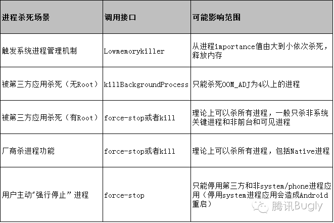

[toc]

## OOM_ADJ

在 Android 系统中，为了有效管理内存，系统会根据应用进程的重要性来决定哪些进程应该优先被终止以释放内存。这种进程的重要性由一个内部的优先级参数来表示，称为 `OOM_ADJ`（Out Of Memory Adjust）。

### OOM_ADJ（Out Of Memory Adjust）

`OOM_ADJ` 是一个用于标记进程的重要性和优先级的参数。当系统内存不足时，Android 会根据每个进程的 `OOM_ADJ` 值来决定哪些进程应该被杀死以释放内存。`OOM_ADJ` 的值越低，进程的优先级越高，越不容易被杀死；反之，值越高，进程越容易被杀死。

### OOM_ADJ 级别及其解释

| ADJ 级别               | 取值 | 解释                                                |
| ---------------------- | ---- | --------------------------------------------------- |
| UNKNOWN_ADJ            | 16   | 一般指将要成为缓存进程，无法获取确定值              |
| CACHED_APP_MAX_ADJ     | 15   | 不可见进程的 adj 最大值                             |
| CACHED_APP_MIN_ADJ     | 9    | 不可见进程的 adj 最小值                             |
| SERVICE_B_ADJ          | 8    | B List 中的 Service（较老的、使用可能性更小）       |
| PREVIOUS_APP_ADJ       | 7    | 上一个 App 的进程（往往通过按返回键离开的）         |
| HOME_APP_ADJ           | 6    | Home 进程                                           |
| SERVICE_ADJ            | 5    | 服务进程（Service process）                         |
| HEAVY_WEIGHT_APP_ADJ   | 4    | 后台的重量级进程，system/rootdir/init.rc 文件中设置 |
| BACKUP_APP_ADJ         | 3    | 备份进程                                            |
| PERCEPTIBLE_APP_ADJ    | 2    | 可感知进程，比如后台音乐播放                        |
| VISIBLE_APP_ADJ        | 1    | 可见进程（Visible process）                         |
| FOREGROUND_APP_ADJ     | 0    | 前台进程（Foreground process）                      |
| PERSISTENT_SERVICE_ADJ | -11  | 关联着系统或 persistent 进程                        |
| PERSISTENT_PROC_ADJ    | -12  | 系统 persistent 进程，比如 telephony                |
| SYSTEM_ADJ             | -16  | 系统进程                                            |
| NATIVE_ADJ             | -17  | native 进程（不被系统管理）                         |

### 各个级别的详细解释

1. **UNKNOWN_ADJ (16)**：
   - 这些进程即将成为缓存进程，无法确定其具体值。
   - 通常是系统在缓存进程状态变动时的临时状态。
2. **CACHED_APP_MAX_ADJ (15)**：
   - 不可见进程的最大 adj 值，表示这些进程在系统内存紧张时最容易被杀死。
   - 这些进程对用户当前的体验没有直接影响。
3. **CACHED_APP_MIN_ADJ (9)**：
   - 不可见进程的最小 adj 值，表示这些进程相对于最大值而言稍微重要一些，但仍然容易被杀死。
   - 这包括一些后台进程，它们的状态可能会在用户重新访问时恢复。
4. **SERVICE_B_ADJ (8)**：
   - B List 中的 Service，通常是较老的服务，使用的可能性较小。
   - 在内存紧张时，系统会优先杀死这些服务以释放资源。
5. **PREVIOUS_APP_ADJ (7)**：
   - 上一个应用的进程，这些进程往往是用户通过按返回键离开的应用。
   - 保持这些进程可以让用户快速返回上一个应用，而不需要重新启动。
6. **HOME_APP_ADJ (6)**：
   - Home 进程，负责管理主屏幕的应用。
   - 保持 Home 进程的存活对于系统的流畅性和用户体验非常重要。
7. **SERVICE_ADJ (5)**：
   - 服务进程，这些进程在后台执行一些任务，如下载、播放音乐等。
   - 这些进程比一般的后台进程更重要，系统会尽量保持它们的存活。
8. **HEAVY_WEIGHT_APP_ADJ (4)**：
   - 后台的重量级进程，通常在 system/rootdir/init.rc 文件中设置。
   - 这些进程占用大量资源，系统会根据内存情况决定是否保留。
9. **BACKUP_APP_ADJ (3)**：
   - 备份进程，负责执行系统备份任务。
   - 系统会优先保留这些进程以确保备份任务的顺利进行。
10. **PERCEPTIBLE_APP_ADJ (2)**：
    - 可感知进程，比如后台音乐播放，用户能够感知到它们的存在。
    - 系统会优先保留这些进程以确保用户体验的连续性。
11. **VISIBLE_APP_ADJ (1)**：
    - 可见进程，虽然不在前台，但对用户仍然可见，如部分显示在屏幕上的对话框。
    - 这些进程对用户体验非常重要，系统会优先保留。
12. **FOREGROUND_APP_ADJ (0)**：
    - 前台进程，当前用户正在使用的应用。
    - 优先级最高，系统会尽量不杀死这些进程以确保用户体验。
13. **PERSISTENT_SERVICE_ADJ (-11)**：
    - 关联着系统或 persistent 进程，如系统的某些服务。
    - 系统会尽量保留这些进程，因为它们对系统的稳定性和功能至关重要。
14. **PERSISTENT_PROC_ADJ (-12)**：
    - 系统 persistent 进程，如 telephony 服务。
    - 系统会尽量保留这些进程，因为它们对系统的稳定性和功能至关重要。
15. **SYSTEM_ADJ (-16)**：
    - 系统进程，负责核心系统功能。
    - 系统会尽量保留这些进程，因为它们对系统的运行至关重要。
16. **NATIVE_ADJ (-17)**：
    - native 进程，不被系统管理。
    - 这些进程一般是系统核心进程，完全不受 Android 内存管理策略影响。

## 进程被杀死情况

####  触发系统进程管理机制

- **调用接口**：`Lowmemorykiller`
- **可能影响范围**：从进程 importance 值由大到小依次杀死，释放内存。

##### 说明：

- `Lowmemorykiller` 是 Android 内核中的一个进程杀手，当系统内存不足时，它会按照进程的重要性（importance）值从大到小依次杀死进程。
- 影响范围取决于内存需求，系统会优先杀死低优先级的进程（如 `CACHED_APP`），以确保高优先级的进程（如 `FOREGROUND_APP`）能够继续运行。

#### 2. 被第三方应用杀死（无 Root）

- **调用接口**：`killBackgroundProcess`
- **可能影响范围**：只会杀死 `OOM_ADJ` 值为 9 以上的进程（后台进程）。

##### 说明：

- 通过 `killBackgroundProcess` 接口，第三方应用只能杀死后台进程，这些进程的 `OOM_ADJ` 值通常较高，属于不可见或低优先级的进程。

#### 3. 被第三方应用杀死（有 Root）

- **调用接口**：`force-stop` 或 `kill`
- **可能影响范围**：理论上可以杀死所有进程，一般只杀非系统关键进程和目前可见进程。

##### 说明：

- 通过 `force-stop` 或 `kill` 接口，拥有 Root 权限的应用可以终止几乎任何进程，但通常只会终止非系统关键进程和用户当前可见的进程。
- 这种操作可能会影响应用的稳定性和用户体验，因此在生产环境中不建议使用。

#### 4. 商店进程功能

- **调用接口**：`force-stop` 或 `kill`
- **可能影响范围**：理论上可以杀死所有进程，包括 Native 进程。

##### 说明：

- 应用商店或管理工具可以使用这些接口来终止任意进程，甚至包括 Native 进程。
- 这种操作通常用于清理内存或关闭无响应的应用。

#### 5. 用户主动“强行停止”进程

- **调用接口**：`force-stop`
- **可能影响范围**：只能停用第三方和非 system/phone 进程应用（停用 system 进程应用会导致 Android 重启）。

##### 说明：

- 用户在设置中选择“强行停止”某个应用时，系统会调用 `force-stop` 接口，终止该应用的所有进程。
- 这种操作主要用于停止有问题的应用，释放系统资源。

### 总结

- **`Lowmemorykiller`**：由系统内核管理，用于在内存不足时根据进程重要性杀死进程。
- **`killBackgroundProcess`**：用于终止后台进程，通常由第三方应用在无 Root 环境下使用。
- **`force-stop` 或 `kill`（有 Root）**：用于终止任意进程，通常由拥有 Root 权限的应用使用。
- **`force-stop` 或 `kill`（商店进程功能）**：用于清理内存或关闭无响应的应用，包括终止 Native 进程。
- **用户主动“强行停止”**：用户在设置中手动停止应用，终止其所有进程。

### 补充：厂商杀进程功能为什么被叫做商店进程功能？

这个称呼来源于应用商店或系统管理工具的实际功能，这些工具通常附带在设备出厂时的系统中，由设备制造商（厂商）提供和管理。

假设你使用的是华为手机，华为系统管理工具中提供了一个“手机管家”应用，这个应用可以帮助用户管理设备上的所有进程：