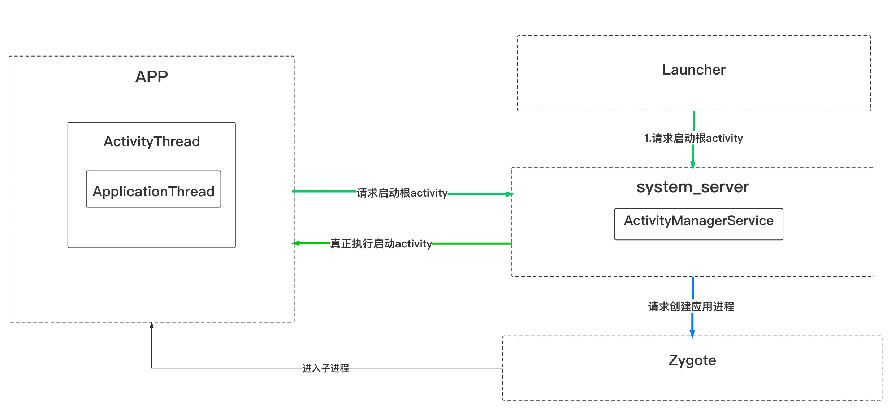

[toc]

https://juejin.cn/post/6847902222294990862

## 1. 概述

启动activity代码如下：

```java
Intent intent = new Intent(this, TestActivity.class);
this.startActivity(intent);
```

这样就可以启动TestActivity了，那么问题来了，

- 这个代码是如何启动一个Activity的？
- 里面做了哪些事情？
- onCreate这些生命周期是何时执行的？
- Activity对象何时创建的？
- 视图是怎么处理以及何时可见的？
- 根activity（第一个activity）又是如何启动的？

这里先给出 Activity启动 的 整体交互图：



其中创建应用进程的逻辑一般在启动**根activity**时会走到，普通activity不涉及Launcher和Zygote。


## 2. 流程分析

### 2.1 Activity启动的发起

启动Activity的操作从客户端 跨进程 转移到 ATMS。

下面我们就来对Activity的工作流程进行梳理，达到对Activity整体流程的掌握。从startActivity方法开始，会走到startActivityForResult方法：

```java
public void startActivityForResult(@RequiresPermission Intent intent, int requestCode,
            @Nullable Bundle options) {
        if (mParent == null) {
            options = transferSpringboardActivityOptions(options);
            Instrumentation.ActivityResult ar =
                mInstrumentation.execStartActivity(
                    this, mMainThread.getApplicationThread(), mToken, this,
                    intent, requestCode, options);
            if (ar != null) {
                mMainThread.sendActivityResult(
                    mToken, mEmbeddedID, requestCode, ar.getResultCode(),
                    ar.getResultData());
            }
            if (requestCode >= 0) {
                mStartedActivity = true;
            }

            cancelInputsAndStartExitTransition(options);
        } else {
            ...
        }
    }
```

看到里面调用了mInstrumentation.execStartActivity方法，其是Instrumentation类中的方法。其中一个参数：mMainThread.getApplicationThread()，它的类型是ApplicationThread，**ApplicationThread是ActivityThread的内部类，继承IApplicationThread.Stub，也是个Binder对象**，在Activity工作流程中有重要作用。

#### Instrumentation类

`Instrumentation`（仪表） 类用于监控应用程序和 Activity 的生命周期，主要功能包括：

- **跟踪应用和 Activity 的生命周期**：通过 `execStartActivity` 方法，`Instrumentation` 可以拦截并监控 Activity 的启动过程。
- **测试框架**：`Instrumentation` 常用于 Android 测试框架，帮助开发者测试应用的各个部分。

```java
 public ActivityResult execStartActivity(
            Context who, IBinder contextThread, IBinder token, Activity target,
            Intent intent, int requestCode, Bundle options) {
        IApplicationThread whoThread = (IApplicationThread) contextThread;
        Uri referrer = target != null ? target.onProvideReferrer() : null;
        if (referrer != null) {
            intent.putExtra(Intent.EXTRA_REFERRER, referrer);
        }
        ...

        try {
            intent.migrateExtraStreamToClipData();
            intent.prepareToLeaveProcess(who);
            int result = ActivityTaskManager.getService()
                .startActivity(whoThread, who.getBasePackageName(), intent,
                        intent.resolveTypeIfNeeded(who.getContentResolver()),
                        token, target != null ? target.mEmbeddedID : null,
                        requestCode, 0, null, options);
            checkStartActivityResult(result, intent);
        } catch (RemoteException e) {
            throw new RuntimeException("Failure from system", e);
        }
        return null;
    }
```

这里看到Activity的启动又交给了ActivityTaskManager.getService()，这是啥？跟进去看看：

```java
//ActivityTaskManager
    public static IActivityTaskManager getService() {
        return IActivityTaskManagerSingleton.get();
    }
    
    private static final Singleton<IActivityTaskManager> IActivityTaskManagerSingleton =
            new Singleton<IActivityTaskManager>() {
                @Override
                protected IActivityTaskManager create() {
                    final IBinder b = ServiceManager.getService(Context.ACTIVITY_TASK_SERVICE);
                    return IActivityTaskManager.Stub.asInterface(b);
                }
            };
```

看到 `IBinder` 标志，意味着这里获取的是一个跨进程的服务。具体来说，这里获取的是 `ActivityTaskManagerService`（ATMS），它继承自 `IActivityTaskManager.Stub`，是一个 Binder 对象，并通过单例模式提供服务。

- **ActivityTaskManagerService (ATMS)**：用于管理 Activity 及其容器（任务、堆栈、显示等）的系统服务，运行在系统服务进程（`system_server`）中。

可以理解为，ATMS 隶属于 AMS，用于更好地管理 Activity 相关的任务和堆栈。

接着看，ActivityTaskManager.getService().startActivity调用了checkStartActivityResult(result, intent)：

```java
 public static void checkStartActivityResult(int res, Object intent) {
        if (!ActivityManager.isStartResultFatalError(res)) {
            return;
        }

        switch (res) {
            case ActivityManager.START_INTENT_NOT_RESOLVED:
            case ActivityManager.START_CLASS_NOT_FOUND:
                if (intent instanceof Intent && ((Intent)intent).getComponent() != null)
                    throw new ActivityNotFoundException(
                            "Unable to find explicit activity class "
                            + ((Intent)intent).getComponent().toShortString()
                            + "; have you declared this activity in your AndroidManifest.xml?");
                throw new ActivityNotFoundException(
                        "No Activity found to handle " + intent);
            case ActivityManager.START_PERMISSION_DENIED:
                throw new SecurityException("Not allowed to start activity "
                        + intent);
            ...
            
            case ActivityManager.START_CANCELED:
                throw new AndroidRuntimeException("Activity could not be started for "
                        + intent);
            default:
                throw new AndroidRuntimeException("Unknown error code "
                        + res + " when starting " + intent);
        }
    }
```

这是用来检查Activity启动的结果，如果发生致命错误，就会抛出对应的异常。看到第一个case中就抛出了 have you declared this activity in your AndroidManifest.xml?——如果Activity没在Manifest中注册就会有这个错误。


好了，到这里，Activity的启动就跨进程（IPC）的转移到系统进程提供的服务ATMS中了，接着看ATMS的startActivity：

### 补充：应用程序将请求发送给应用程序

启动过程从应用程序传递到ATMS中是通过获取ATMS的唯一单例，并调用其启动activity的方法实现的。

#### 1. 应用程序发起启动请求

在应用程序中，当调用 `startActivity` 或 `startActivityForResult` 方法时，启动请求首先由 `Activity` 类的方法处理。

#### 2. 通过 Instrumentation 发送请求

在 `startActivityForResult` 方法中，调用 `Instrumentation.execStartActivity` 方法，这个方法负责将启动请求发送到系统服务。

#### 3. 获取 ATMS 的单例

`Instrumentation.execStartActivity` 方法内部通过 `ActivityManager.getService()` 获取 `ActivityTaskManagerService` 的单例。

#### 4. 调用 ATMS 的启动方法

获取到 ATMS 的单例后，调用其 `startActivity` 方法来处理启动请求。

#### 5. ATMS 处理启动请求

`ActivityTaskManagerService` 接收到启动请求后，创建 `ClientTransaction` 实例并通过 Binder 机制将其传递给应用程序的主线程进行处理。


### 2.2 Activity的管理——ATMS

ATMS通过ActivityStarter、ActivityStack、ActivityStackSupervisor 对 Activity任务、activity栈、Activity记录 管理后，又用过跨进程把正在启动过程又转移到了客户端。

```java
//ActivityTaskManagerService
    @Override
    public final int startActivity(IApplicationThread caller, String callingPackage,
            Intent intent, String resolvedType, IBinder resultTo, String resultWho, int requestCode,
            int startFlags, ProfilerInfo profilerInfo, Bundle bOptions) {
        return startActivityAsUser(caller, callingPackage, intent, resolvedType, resultTo,
                resultWho, requestCode, startFlags, profilerInfo, bOptions,
                UserHandle.getCallingUserId());
    }
    
    @Override
    public int startActivityAsUser(IApplicationThread caller, String callingPackage,
            Intent intent, String resolvedType, IBinder resultTo, String resultWho, int requestCode,
            int startFlags, ProfilerInfo profilerInfo, Bundle bOptions, int userId) {
        return startActivityAsUser(caller, callingPackage, intent, resolvedType, resultTo,
                resultWho, requestCode, startFlags, profilerInfo, bOptions, userId,
                true /*validateIncomingUser*/);
    }

    int startActivityAsUser(IApplicationThread caller, String callingPackage,
            Intent intent, String resolvedType, IBinder resultTo, String resultWho, int requestCode,
            int startFlags, ProfilerInfo profilerInfo, Bundle bOptions, int userId,
            boolean validateIncomingUser) {
        enforceNotIsolatedCaller("startActivityAsUser");

        userId = getActivityStartController().checkTargetUser(userId, validateIncomingUser,
                Binder.getCallingPid(), Binder.getCallingUid(), "startActivityAsUser");

        // TODO: Switch to user app stacks here.
        return getActivityStartController().obtainStarter(intent, "startActivityAsUser")
                .setCaller(caller)
                .setCallingPackage(callingPackage)
                .setResolvedType(resolvedType)
                .setResultTo(resultTo)
                .setResultWho(resultWho)
                .setRequestCode(requestCode)
                .setStartFlags(startFlags)
                .setProfilerInfo(profilerInfo)
                .setActivityOptions(bOptions)
                .setMayWait(userId)
                .execute();

    }
```

跟到startActivityAsUser中，通过getActivityStartController().obtainStarter方法获取ActivityStarter实例 然后调用一系列方法，最后的execute()方法是开始启动activity：

```java
int execute() {
        try {
            // TODO(b/64750076): Look into passing request directly to these methods to allow
            // for transactional diffs and preprocessing.
            if (mRequest.mayWait) {
                return startActivityMayWait(mRequest.caller, mRequest.callingUid,
                        mRequest.callingPackage, mRequest.realCallingPid, mRequest.realCallingUid,
                        mRequest.intent, mRequest.resolvedType,
                        mRequest.voiceSession, mRequest.voiceInteractor, mRequest.resultTo,
                        mRequest.resultWho, mRequest.requestCode, mRequest.startFlags,
                        mRequest.profilerInfo, mRequest.waitResult, mRequest.globalConfig,
                        mRequest.activityOptions, mRequest.ignoreTargetSecurity, mRequest.userId,
                        mRequest.inTask, mRequest.reason,
                        mRequest.allowPendingRemoteAnimationRegistryLookup,
                        mRequest.originatingPendingIntent, mRequest.allowBackgroundActivityStart);
            } else {
                return startActivity(mRequest.caller, mRequest.intent, mRequest.ephemeralIntent,
                        mRequest.resolvedType, mRequest.activityInfo, mRequest.resolveInfo,
                        mRequest.voiceSession, mRequest.voiceInteractor, mRequest.resultTo,
                        mRequest.resultWho, mRequest.requestCode, mRequest.callingPid,
                        mRequest.callingUid, mRequest.callingPackage, mRequest.realCallingPid,
                        mRequest.realCallingUid, mRequest.startFlags, mRequest.activityOptions,
                        mRequest.ignoreTargetSecurity, mRequest.componentSpecified,
                        mRequest.outActivity, mRequest.inTask, mRequest.reason,
                        mRequest.allowPendingRemoteAnimationRegistryLookup,
                        mRequest.originatingPendingIntent, mRequest.allowBackgroundActivityStart);
            }
        } finally {
            onExecutionComplete();
        }
    }
```

分了两种情况，不过 不论startActivityMayWait还是startActivity最终都是走到下面这个startActivity方法：

```java
   private int startActivity(final ActivityRecord r, ActivityRecord sourceRecord,
                IVoiceInteractionSession voiceSession, IVoiceInteractor voiceInteractor,
                int startFlags, boolean doResume, ActivityOptions options, TaskRecord inTask,
                ActivityRecord[] outActivity, boolean restrictedBgActivity) {
        int result = START_CANCELED;
        final ActivityStack startedActivityStack;
        try {
            mService.mWindowManager.deferSurfaceLayout();
            result = startActivityUnchecked(r, sourceRecord, voiceSession, voiceInteractor,
                    startFlags, doResume, options, inTask, outActivity, restrictedBgActivity);
        } finally {
            final ActivityStack currentStack = r.getActivityStack();
            startedActivityStack = currentStack != null ? currentStack : mTargetStack;

           ...
        }

        postStartActivityProcessing(r, result, startedActivityStack);
        return result;
    }
```

里面有调用了startActivityUnchecked方法，之后调用RootActivityContainer的resumeFocusedStacksTopActivities方法。RootActivityContainer是Android10新增的类，分担了之前ActivityStackSupervisor的部分功能。接着跳转到ActivityStack的resumeTopActivityUncheckedLocked方法：

```java
//ActivityStack
    boolean resumeTopActivityUncheckedLocked(ActivityRecord prev, ActivityOptions options) {
        if (mInResumeTopActivity) {
            // Don't even start recursing.
            return false;
        }
        boolean result = false;
        try {
            mInResumeTopActivity = true;
            result = resumeTopActivityInnerLocked(prev, options);

            final ActivityRecord next = topRunningActivityLocked(true /* focusableOnly */);
            if (next == null || !next.canTurnScreenOn()) {
                checkReadyForSleep();
            }
        } finally {
            mInResumeTopActivity = false;
        }

        return result;
    }
```

跟进resumeTopActivityInnerLocked方法：

```java
 private boolean resumeTopActivityInnerLocked(ActivityRecord prev, ActivityOptions options) {
        ...
        boolean pausing = getDisplay().pauseBackStacks(userLeaving, next, false);
        if (mResumedActivity != null) {
            if (DEBUG_STATES) Slog.d(TAG_STATES,
                    "resumeTopActivityLocked: Pausing " + mResumedActivity);
             // 暂停上一个Activity
            pausing |= startPausingLocked(userLeaving, false, next, false);
        }
        ...
        //这里next.attachedToProcess()，只有启动了的Activity才会返回true
        if (next.attachedToProcess()) {
            ...
            
            try {
                final ClientTransaction transaction =
                        ClientTransaction.obtain(next.app.getThread(), next.appToken);
                ...
                //启动了的Activity就发送ResumeActivityItem事务给客户端了，后面会讲到
                transaction.setLifecycleStateRequest(
                        ResumeActivityItem.obtain(next.app.getReportedProcState(),
                                getDisplay().mDisplayContent.isNextTransitionForward()));
                mService.getLifecycleManager().scheduleTransaction(transaction);
               ....
            } catch (Exception e) {
                ....
                mStackSupervisor.startSpecificActivityLocked(next, true, false);
                return true;
            }
            ....
        } else {
            ....
            if (SHOW_APP_STARTING_PREVIEW) {
            	    //这里就是 冷启动时 出现白屏 的原因了：取根activity的主题背景 展示StartingWindow
                    next.showStartingWindow(null , false ,false);
                }
            // 继续当前Activity，普通activity的正常启动 关注这里即可
            mStackSupervisor.startSpecificActivityLocked(next, true, true);
        }
        return true;
    }
```

先对上一个Activity执行pause操作，再执行当前创建操作，代码最终进入到了ActivityStackSupervisor.startSpecificActivityLocked方法中。这里有个点注意下，启动activity前调用了next.showStartingWindow方法来展示一个window，这就是 **冷启动时 出现白屏 的原因**了。

#### 冷启动：

**冷启动**是指应用程序从完全未运行的状态启动。在冷启动时，系统需要做大量的工作来准备应用的运行环境，包括加载应用的资源、初始化应用的进程、启动 Activity 等。这一过程通常需要较长的时间，用户可能会注意到明显的启动延迟。

#### 冷启动时出现白屏

**冷启动时出现白屏**是指在冷启动过程中，用户看到一个空白的屏幕。白屏通常出现在应用的第一帧 UI 尚未准备好或绘制完成之前。


我们继续看ActivityStackSupervisor.startSpecificActivityLocked方法：

```java
    void startSpecificActivityLocked(ActivityRecord r, boolean andResume, boolean checkConfig) {
        // Is this activity's application already running?
        final WindowProcessController wpc =
                mService.getProcessController(r.processName, r.info.applicationInfo.uid);

        boolean knownToBeDead = false;
        if (wpc != null && wpc.hasThread()) {
            try {
                realStartActivityLocked(r, wpc, andResume, checkConfig);
                return;
            } catch (RemoteException e) {
                Slog.w(TAG, "Exception when starting activity "
                        + r.intent.getComponent().flattenToShortString(), e);
            }
            knownToBeDead = true;
        }

        ...
        
        try {
            if (Trace.isTagEnabled(TRACE_TAG_ACTIVITY_MANAGER)) {
                Trace.traceBegin(TRACE_TAG_ACTIVITY_MANAGER, "dispatchingStartProcess:"
                        + r.processName);
            }
            // 上面的wpc != null && wpc.hasThread()不满足的话，说明没有进程，就会取创建进程
            final Message msg = PooledLambda.obtainMessage(
                    ActivityManagerInternal::startProcess, mService.mAmInternal, r.processName,
                    r.info.applicationInfo, knownToBeDead, "activity", r.intent.getComponent());
            mService.mH.sendMessage(msg);
        } finally {
            Trace.traceEnd(TRACE_TAG_ACTIVITY_MANAGER);
        }
    }
```

有个判断条件if (wpc != null && wpc.hasThread())，意思是是否启动了应用进程，内部是通过IApplicationThread是否为空来判断。这里我们只看已启动应用进程的情况，及调用了realStartActivityLocked方法，，：

```java
boolean realStartActivityLocked(ActivityRecord r, WindowProcessController proc,
            boolean andResume, boolean checkConfig) throws RemoteException {
	
			...

                // Create activity launch transaction.
                final ClientTransaction clientTransaction = ClientTransaction.obtain(
                        proc.getThread(), r.appToken);

                final DisplayContent dc = r.getDisplay().mDisplayContent;
                clientTransaction.addCallback(LaunchActivityItem.obtain(new Intent(r.intent),
                        System.identityHashCode(r), r.info,
                        // TODO: Have this take the merged configuration instead of separate global
                        // and override configs.
                        mergedConfiguration.getGlobalConfiguration(),
                        mergedConfiguration.getOverrideConfiguration(), r.compat,
                        r.launchedFromPackage, task.voiceInteractor, proc.getReportedProcState(),
                        r.icicle, r.persistentState, results, newIntents,
                        dc.isNextTransitionForward(), proc.createProfilerInfoIfNeeded(),
                                r.assistToken));

                // Set desired final state.
                final ActivityLifecycleItem lifecycleItem;
                if (andResume) {
                    lifecycleItem = ResumeActivityItem.obtain(dc.isNextTransitionForward());
                } else {
                    lifecycleItem = PauseActivityItem.obtain();
                }
                clientTransaction.setLifecycleStateRequest(lifecycleItem);

                // Schedule transaction.
                mService.getLifecycleManager().scheduleTransaction(clientTransaction);

                ...

        return true;
    }
```

中间有段代码如上，通过 ClientTransaction.obtain( proc.getThread(), r.appToken)获取了clientTransaction，其中参数proc.getThread()是IApplicationThread，就是前面提到的ApplicationThread在系统进程的代理。

**ClientTransaction**是包含一系列的待客户端处理的事务的容器，客户端接收后取出事务并执行。

接着看，使用clientTransaction.addCallback添加了LaunchActivityItem实例：

```java
//都是用来发送到客户端的
	private List<ClientTransactionItem> mActivityCallbacks;
	
    public void addCallback(ClientTransactionItem activityCallback) {
        if (mActivityCallbacks == null) {
            mActivityCallbacks = new ArrayList<>();
        }
        mActivityCallbacks.add(activityCallback);
    }
```

看下LaunchActivityItem实例的获取：

```java
/** Obtain an instance initialized with provided params. */
    public static LaunchActivityItem obtain(Intent intent, int ident, ActivityInfo info,
            Configuration curConfig, Configuration overrideConfig, CompatibilityInfo compatInfo,
            String referrer, IVoiceInteractor voiceInteractor, int procState, Bundle state,
            PersistableBundle persistentState, List<ResultInfo> pendingResults,
            List<ReferrerIntent> pendingNewIntents, boolean isForward, ProfilerInfo profilerInfo,
            IBinder assistToken) {
        LaunchActivityItem instance = ObjectPool.obtain(LaunchActivityItem.class);
        if (instance == null) {
            instance = new LaunchActivityItem();
        }
        setValues(instance, intent, ident, info, curConfig, overrideConfig, compatInfo, referrer,
                voiceInteractor, procState, state, persistentState, pendingResults,
                pendingNewIntents, isForward, profilerInfo, assistToken);

        return instance;
    }
```

new了一个LaunchActivityItem然后设置各种值。我们从名字就能看出，它就是用来启动activity的。它是怎么发挥作用的呢？接着看：

回到realStartActivityLocked方法，接着调用了mService.getLifecycleManager().scheduleTransaction(clientTransaction)，mService是ActivityTaskManagerService，getLifecycleManager()方法获取的是ClientLifecycleManager实例，它的scheduleTransaction方法如下：

```java
void scheduleTransaction(ClientTransaction transaction) throws RemoteException {
        final IApplicationThread client = transaction.getClient();
        transaction.schedule();
        if (!(client instanceof Binder)) {
            transaction.recycle();
        }
    }
```

就是调用ClientTransaction的schedule方法，那就看看：

```java
public void schedule() throws RemoteException {
        mClient.scheduleTransaction(this);
    }
```

很简单，就是调用IApplicationThread的scheduleTransaction方法。由于IApplicationThread是ApplicationThread在系统进程的代理，所以真正执行的地方就是 客户端的ApplicationThread中了。也就是说，**Activity启动的操作又跨进程的还给了客户端**。

好了，到这里我们稍稍梳理下：启动Activity的操作从客户端 跨进程 转移到 ATMS，ATMS通过ActivityStarter、ActivityStack、ActivityStackSupervisor 对 Activity任务、activity栈、Activity记录 管理后，又用过跨进程把正在启动过程又转移到了客户端。


### 补充：ATMS将请求转移给应用程序：

1. **应用主线程与系统服务通信**：

   应用的主线程通过 `ActivityThread` 运行，该线程的内部类 `ApplicationThread` 实现了 `IApplicationThread.Stub` 接口，这是一个 Binder 对象，用于在应用进程与系统服务之间进行通信。

2. **ATMS 处理启动请求**：

   当 `ActivityTaskManagerService`（ATMS）接收到启动 Activity 的请求时，它通过 `proc.getThread()` 获取应用主线程的 Binder 对象 `ApplicationThread`。

3. **创建 ClientTransaction**：

   ATMS 创建一个 `ClientTransaction` 实例，并将其与主线程的 Binder 对象（`IApplicationThread`）关联。`ClientTransaction` 是一个事务容器，包含应用需要处理的一系列事务。

4. **添加 LaunchActivityItem**：

   - ATMS 使用 `clientTransaction.addCallback` 方法向 `ClientTransaction` 中添加一个 `LaunchActivityItem` 事务项。
   - `LaunchActivityItem` 是启动 Activity 的具体事务项，包含启动 Activity 所需的所有信息。

5. **传递事务**：

   - ATMS 调用 `mService.getLifecycleManager().scheduleTransaction(clientTransaction)` 方法，通过 Binder 机制将 `ClientTransaction` 发送到应用程序。

   

### 2.3 线程切换及消息处理——mH

流程如下：

- `scheduleTransaction` 方法通过 `sendMessage` 将 `ClientTransaction` 发送到 `ActivityThread` 的 `H`。
- `H` 是 `ActivityThread` 的内部类，继承自 `Handler`，用于在主线程处理消息。
- `H` 接收到 `EXECUTE_TRANSACTION` 消息后，调用 `TransactionExecutor` 的 `execute` 方法处理 `ClientTransaction`。
- `TransactionExecutor` 调用 `LaunchActivityItem` 的 `execute` 方法。
- `LaunchActivityItem` 调用 `ActivityThread` 的 `handleLaunchActivity` 方法，启动新的 Activity。

### 2.4 Activity启动核心实现——初始化及生命周期
