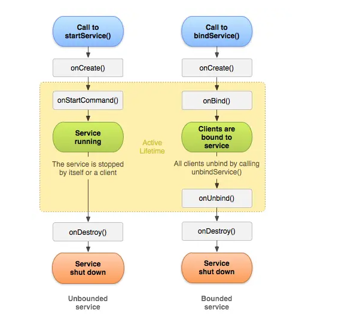

[toc]

## 1. Service

**Service** 是后台应用，用于执行需要长时间保持运行的任务。其主要分为以下两类：

### 1. 启动服务（Started Service）

#### 概念

启动服务是一种一旦启动便在后台运行的服务，除非被明确停止，否则会一直运行。


### 2. 绑定服务（Bound Service）

#### 概念

绑定服务是一种当组件（如 Activity）与之绑定时运行的服务。绑定服务允许组件与服务进行交互，提供客户端-服务器接口。


### 3.两者区别

启动服务：

- 生命周期：服务一旦启动，除非明确调用 `stopService(Intent)` 或 `stopSelf()` 停止，否则会一直运行。
- 应用场景：适用于需要在后台长时间运行的任务，如播放音乐、下载文件等。

绑定服务：

- 生命周期：服务在至少有一个客户端绑定时运行，所有客户端解绑后服务销毁。
- 应用场景：适用于需要与服务进行交互并获取结果的任务，如获取传感器数据、计算结果等。


## 2. 生命周期



#### 启动服务（Unbounded Service）

1. **onCreate()**
   - 在服务创建时调用。这个方法只调用一次，用于初始化服务。
2. **onStartCommand(Intent, int, int)**
   - 每次通过 `startService(Intent)` 启动服务时调用。可以多次调用，表示服务每次启动时的工作。
   - 返回值决定了系统在服务被终止后是否重新创建服务：
     - `START_NOT_STICKY`：如果服务被终止后，不重新创建，除非有新的启动请求。
     - `START_STICKY`：如果服务被终止后，系统会重新创建服务，但不会重新传递最后一个 `Intent`，适合不依赖 `Intent` 的服务。
     - `START_REDELIVER_INTENT`：如果服务被终止后，系统会重新创建服务，并重新传递最后一个 `Intent`。
3. **服务运行中**
   - 服务在后台执行任务，直到明确调用 `stopSelf()` 或 `stopService(Intent)` 停止服务。
4. **onDestroy()**
   - 服务销毁时调用。释放资源，停止后台任务。

#### 绑定服务（Bound Service）

- **onCreate()**：服务创建时调用。
- **onBind(Intent)**：服务绑定时调用，返回一个 `IBinder` 接口供客户端使用。
- **onUnbind(Intent)**：所有客户端解绑时调用。
- **onDestroy()**：服务销毁时调用。

### 服务的启动模式

- **START_NOT_STICKY**：
  - 如果系统在 `onStartCommand()` 返回后终止服务，则除非有新的启动请求，否则系统不会重建服务。
  - 适用于不需要在终止后重启的任务。
- **START_STICKY**：
  - 如果系统在 `onStartCommand()` 返回后终止服务，则会重建服务并调用 `onStartCommand()`，但不会重新传递最后一个 Intent。
  - 适用于需要持续运行的任务，例如音乐播放器。
- **START_REDELIVER_INTENT**：
  - 如果系统在 `onStartCommand()` 返回后终止服务，则会重建服务，并通过传递给服务的最后一个 Intent 调用 `onStartCommand()`。
  - 适用于需要恢复执行中断任务的服务，例如下载文件。

## 3. 启用前台服务

启用前台服务可以确保服务在系统内存不足时不会被终止，同时它会在通知栏显示一个持续的通知，提醒用户该服务正在运行。这对于需要长时间运行的重要后台任务（如音乐播放、位置跟踪等）特别有用。

### 启用前台服务的步骤

1. **声明权限**：在 `AndroidManifest.xml` 文件中声明前台服务权限。
2. **创建通知**：创建一个 `Notification`，用于显示在通知栏中。
3. **启动前台服务**：调用 `startForeground` 方法，将服务提升为前台服务。

### 具体步骤和代码示例

#### 1. 在 `AndroidManifest.xml` 中声明权限

在应用的 `AndroidManifest.xml` 文件中添加前台服务权限。

```
xml
复制代码
<uses-permission android:name="android.permission.FOREGROUND_SERVICE"/>
```

#### 2. 创建通知

创建一个通知，用于在通知栏中显示前台服务的状态。

```
java复制代码// 创建一个通知渠道（适用于 Android 8.0 及以上）
if (Build.VERSION.SDK_INT >= Build.VERSION_CODES.O) {
    NotificationChannel channel = new NotificationChannel(
            "foreground_service_channel",
            "Foreground Service Channel",
            NotificationManager.IMPORTANCE_DEFAULT
    );
    NotificationManager manager = getSystemService(NotificationManager.class);
    manager.createNotificationChannel(channel);
}

// 创建通知
Notification notification = new NotificationCompat.Builder(this, "foreground_service_channel")
        .setContentTitle("前台服务标题")
        .setContentText("前台服务正在运行")
        .setSmallIcon(R.drawable.ic_service_icon)
        .setContentIntent(pendingIntent)
        .build();

// 创建一个 PendingIntent，用于通知点击事件
Intent notificationIntent = new Intent(this, ExampleActivity.class);
PendingIntent pendingIntent = PendingIntent.getActivity(this, 0, notificationIntent, 0);
```

#### 3. 启动前台服务

在服务的 `onStartCommand` 方法中调用 `startForeground` 方法，将服务提升为前台服务。

```
java复制代码public class MyForegroundService extends Service {
    private static final int ONGOING_NOTIFICATION_ID = 1;

    @Override
    public void onCreate() {
        super.onCreate();

        // 创建通知渠道（适用于 Android 8.0 及以上）
        if (Build.VERSION.SDK_INT >= Build.VERSION_CODES.O) {
            NotificationChannel channel = new NotificationChannel(
                    "foreground_service_channel",
                    "Foreground Service Channel",
                    NotificationManager.IMPORTANCE_DEFAULT
            );
            NotificationManager manager = getSystemService(NotificationManager.class);
            manager.createNotificationChannel(channel);
        }

        // 创建通知
        Notification notification = new NotificationCompat.Builder(this, "foreground_service_channel")
                .setContentTitle("前台服务标题")
                .setContentText("前台服务正在运行")
                .setSmallIcon(R.drawable.ic_service_icon)
                .setContentIntent(pendingIntent)
                .build();

        // 启动前台服务
        startForeground(ONGOING_NOTIFICATION_ID, notification);
    }

    @Override
    public int onStartCommand(Intent intent, int flags, int startId) {
        // 处理服务启动逻辑
        return START_NOT_STICKY;
    }

    @Override
    public void onDestroy() {
        super.onDestroy();
        // 处理服务销毁逻辑
    }

    @Override
    public IBinder onBind(Intent intent) {
        return null; // 前台服务通常不需要绑定
    }
}
```