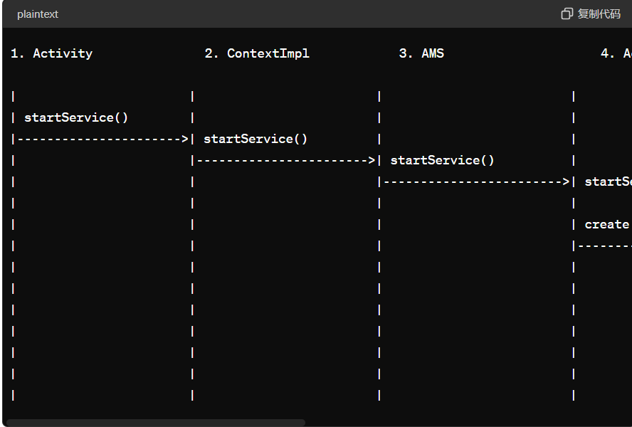
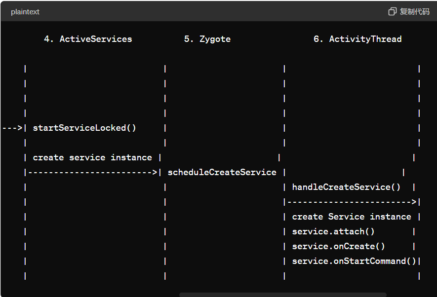

[toc]

## 启动过程

### 启动服务的浓缩框架和流程

#### 1. 概览

启动服务的主要目的是在后台执行一些长时间运行的任务，如播放音乐、下载文件等。启动服务通过 `startService` 方法启动，不需要与客户端进行交互。

#### 2. 流程图解





#### 3. 详细步骤

1. **Activity 调用 `startService` 方法**

   - **作用**：发起启动服务的请求。

   - 代码：

     ```
     java复制代码Intent intent = new Intent(this, MyService.class);
     startService(intent);
     ```

2. **ContextImpl 处理 `startService` 请求**

   - **作用**：将启动请求传递给 `AMS`（ActivityManagerService）。

   - 代码：

     ```
     java复制代码@Override
     public ComponentName startService(Intent service) {
         return ActivityManager.getService().startService(...);
     }
     ```

3. **AMS 处理 `startService` 请求**

   - **作用**：`AMS` 接收请求，开始处理服务启动逻辑，可能需要创建新的服务实例。

   - 代码：

     ```
     java复制代码public ComponentName startService(...) {
         // 调用内部方法处理启动请求
         return mServices.startServiceLocked(...);
     }
     ```

4. **ActiveServices 创建或检索服务实例**

   - **作用**：如果服务未启动，创建服务实例并启动服务进程；如果服务已启动，直接调用服务的 `onStartCommand` 方法。

   - 代码：

     ```
     java复制代码public Service createService(...) {
         // 创建或检索服务实例
         return new Service();
     }
     ```

5. **Zygote 启动新进程**

   - **作用**：如果需要，新进程通过 Zygote 启动。

   - 代码：

     ```
     java
     复制代码
     // 启动新进程的相关代码
     ```

6. **ActivityThread 接管新进程**

   - **作用**：新进程启动后，`ActivityThread` 接管，并处理服务的创建和启动。

   - 代码：

     ```
     java复制代码public void handleCreateService(...) {
         // 创建并初始化服务实例
         Service service = new MyService();
         service.attach(...);
         service.onCreate();
         service.onStartCommand(...);
     }
     ```

7. **Service 实例的生命周期方法**

   - **作用**：服务实例的生命周期方法被调用，开始执行后台任务。

   - 代码：

     ```
     java复制代码public class MyService extends Service {
         @Override
         public void onCreate() {
             super.onCreate();
             // 初始化服务
         }
     
         @Override
         public int onStartCommand(Intent intent, int flags, int startId) {
             // 开始执行服务任务
             return START_STICKY;
         }
     
         @Override
         public void onDestroy() {
             super.onDestroy();
             // 清理资源
         }
     }
     ```

### 关键点总结

- **Activity 发起启动请求**：通过调用 `startService` 方法。
- **ContextImpl 处理请求**：将请求传递给 `AMS`。
- **AMS 管理启动过程**：决定是创建新服务实例还是使用已有实例。
- **ActiveServices 创建或检索服务实例**：如果需要，启动新进程。
- **Zygote 启动新进程**：新进程启动并准备执行服务。
- **ActivityThread 接管新进程**：处理服务的创建和启动请求。
- **Service 实例的生命周期方法**：服务实例被创建并初始化，然后调用 `onStartCommand` 方法开始执行任务。


## 2.Activity

1. **Zygote**:
   - 如果服务在一个新进程中运行，`AMS` 会通过 `Zygote` 启动一个新的应用进程。
2. **ActivityThread**:
   - 新进程启动后，`ActivityThread` 会负责管理应用程序的主线程，并处理启动服务的请求。

```java
@UnsupportedAppUsage
private void handleCreateService(CreateServiceData data) {
    ···
    LoadedApk packageInfo = getPackageInfoNoCheck(
            data.info.applicationInfo, data.compatInfo);
    Service service = null;
    try {
        java.lang.ClassLoader cl = packageInfo.getClassLoader();
        service = packageInfo.getAppFactory()
                .instantiateService(cl, data.info.name, data.intent);
    } 
    ···

    try {
        if (localLOGV) Slog.v(TAG, "Creating service " + data.info.name);

        ContextImpl context = ContextImpl.createAppContext(this, packageInfo);
        context.setOuterContext(service);

        Application app = packageInfo.makeApplication(false, mInstrumentation);
        service.attach(context, this, data.info.name, data.token, app,
                ActivityManager.getService());
        service.onCreate();
        mServices.put(data.token, service);
        try {
            ActivityManager.getService().serviceDoneExecuting(
                    data.token, SERVICE_DONE_EXECUTING_ANON, 0, 0);
        } catch (RemoteException e) {
            throw e.rethrowFromSystemServer();
        }
    } 
    ··· 
}
```

- **获取应用信息和类加载器**：

  ```java
  LoadedApk packageInfo = getPackageInfoNoCheck(data.info.applicationInfo, data.compatInfo);
  ClassLoader cl = packageInfo.getClassLoader();
  ```

- **创建服务实例**：

  ```java
  service = packageInfo.getAppFactory().instantiateService(cl, data.info.name, data.intent);
  ```

- **初始化服务**：

  ```java
  ContextImpl context = ContextImpl.createAppContext(this, packageInfo);
  context.setOuterContext(service);
  Application app = packageInfo.makeApplication(false, mInstrumentation);
  service.attach(context, this, data.info.name, data.token, app, ActivityManager.getService());
  service.onCreate();  // 调用onCreate方法
  ```

- **保存服务实例**：

  ```java
  mServices.put(data.token, service);
  ```

- **通知AMS服务创建完成**：

  ```java
  ActivityManager.getService().serviceDoneExecuting(data.token, SERVICE_DONE_EXECUT
  ```

