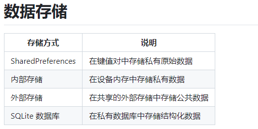

[toc]

## 1. 数据存储



### 数据存储原理解析

- 我们将详细解析四种常见的数据存储方式：SharedPreferences、内部存储、外部存储和 SQLite 数据库。

  ### 1. SharedPreferences

  #### 原理

  - **SharedPreferences** 是安卓系统提供的一种轻量级存储方式，用于存储键值对形式的私有数据。数据以 XML 文件的形式存储在应用的内部存储空间中。
  - 特点：
    - **键值对存储**：数据以键值对的形式存储，可以是布尔值、浮点数、整数、字符串或字符串集。
    - **私有数据**：数据只能被应用自身访问，其他应用无法访问。

  #### 使用场景

  - 保存用户偏好设置，如应用主题（深色模式或浅色模式）、语言设置等。

  #### 示例代码

  ```java
  // 保存数据
  SharedPreferences sharedPref = getSharedPreferences("MyPrefs", Context.MODE_PRIVATE);
  SharedPreferences.Editor editor = sharedPref.edit();
  editor.putString("key_name", "value");
  editor.apply();
  
  // 读取数据
  SharedPreferences sharedPref = getSharedPreferences("MyPrefs", Context.MODE_PRIVATE);
  String value = sharedPref.getString("key_name", "default_value");
  ```

  ### 2. 内部存储

  #### 原理

  - **内部存储** 是指将文件存储在设备的内部存储空间中。这些文件对应用是私有的，其他应用无法访问。
  - 特点：
    - **私有文件**：文件存储在应用的私有目录中，其他应用无法访问。
    - **持久存储**：文件可以持久存储，直到应用被卸载或文件被主动删除。

  #### 使用场景

  - 保存应用的私有数据，如配置文件、缓存数据等。

  #### 示例代码

  ```java
  // 写入文件
  String filename = "myfile.txt";
  String fileContents = "Hello, World!";
  FileOutputStream fos = openFileOutput(filename, Context.MODE_PRIVATE);
  fos.write(fileContents.getBytes());
  fos.close();
  
  // 读取文件
  FileInputStream fis = openFileInput(filename);
  InputStreamReader isr = new InputStreamReader(fis);
  BufferedReader bufferedReader = new BufferedReader(isr);
  StringBuilder sb = new StringBuilder();
  String line;
  while ((line = bufferedReader.readLine()) != null) {
      sb.append(line);
  }
  fis.close();
  String fileContents = sb.toString();
  ```

  ### 3. 外部存储

  #### 原理

  - **外部存储** 是指将文件存储在设备的共享存储空间中，如 SD 卡或设备的外部存储区域。这些文件对所有应用程序可见。
  - 特点：
    - **公共文件**：文件存储在公共目录中，所有应用程序都可以访问。
    - **需要权限**：在 Android 6.0（API 级别 23）及以上，访问外部存储需要动态申请权限。

  #### 使用场景

  - 保存公共数据，如图片、视频、音频文件等。

  #### 示例代码

  ```java
  // 检查存储权限
  if (ContextCompat.checkSelfPermission(this, Manifest.permission.WRITE_EXTERNAL_STORAGE) != PackageManager.PERMISSION_GRANTED) {
      ActivityCompat.requestPermissions(this, new String[]{Manifest.permission.WRITE_EXTERNAL_STORAGE}, 1);
  }
  
  // 写入文件
  String filename = "myfile.txt";
  String fileContents = "Hello, World!";
  File file = new File(Environment.getExternalStoragePublicDirectory(Environment.DIRECTORY_DOCUMENTS), filename);
  FileOutputStream fos = new FileOutputStream(file);
  fos.write(fileContents.getBytes());
  fos.close();
  
  // 读取文件
  FileInputStream fis = new FileInputStream(file);
  InputStreamReader isr = new InputStreamReader(fis);
  BufferedReader bufferedReader = new BufferedReader(isr);
  StringBuilder sb = new StringBuilder();
  String line;
  while ((line = bufferedReader.readLine()) != null) {
      sb.append(line);
  }
  fis.close();
  String fileContents = sb.toString();
  ```

  ### 4. SQLite 数据库

  #### 原理

  - **SQLite 数据库** 是一种嵌入式的关系型数据库管理系统，支持 SQL 语法。每个应用都有自己的私有数据库，其他应用无法访问。
  - 特点：
    - **结构化数据**：适合存储和查询复杂的结构化数据。
    - **关系型数据库**：支持表、索引、视图、触发器等数据库功能。

  #### 使用场景

  - 管理应用中的用户信息、订单记录等需要结构化存储的数据。

  #### 示例代码

  ##### 创建数据库助手类

  ```java
  public class DatabaseHelper extends SQLiteOpenHelper {
  
      private static final String DATABASE_NAME = "mydatabase.db";
      private static final int DATABASE_VERSION = 1;
      private static final String TABLE_NAME = "mytable";
      private static final String COLUMN_ID = "_id";
      private static final String COLUMN_NAME = "name";
  
      public DatabaseHelper(Context context) {
          super(context, DATABASE_NAME, null, DATABASE_VERSION);
      }
  
      @Override
      public void onCreate(SQLiteDatabase db) {
          String CREATE_TABLE = "CREATE TABLE " + TABLE_NAME + " (" +
                  COLUMN_ID + " INTEGER PRIMARY KEY AUTOINCREMENT, " +
                  COLUMN_NAME + " TEXT)";
          db.execSQL(CREATE_TABLE);
      }
  
      @Override
      public void onUpgrade(SQLiteDatabase db, int oldVersion, int newVersion) {
          db.execSQL("DROP TABLE IF EXISTS " + TABLE_NAME);
          onCreate(db);
      }
  }
  ```

  ##### 使用数据库助手类

  ```java
  // 插入数据
  DatabaseHelper dbHelper = new DatabaseHelper(this);
  SQLiteDatabase db = dbHelper.getWritableDatabase();
  ContentValues values = new ContentValues();
  values.put("name", "John Doe");
  long newRowId = db.insert("mytable", null, values);
  
  // 查询数据
  SQLiteDatabase db = dbHelper.getReadableDatabase();
  String[] projection = { "_id", "name" };
  Cursor cursor = db.query("mytable", projection, null, null, null, null, null);
  while (cursor.moveToNext()) {
      long itemId = cursor.getLong(cursor.getColumnIndexOrThrow("_id"));
      String itemName = cursor.getString(cursor.getColumnIndexOrThrow("name"));
      // 处理数据
  }
  cursor.close();
  ```

  ### 总结

  1. **SharedPreferences**：适用于存储简单的键值对数据，如用户设置和应用配置。数据存储在私有的 XML 文件中。
  2. **内部存储**：适用于存储应用的私有数据，文件存储在应用的私有目录中，对其他应用不可见。
  3. **外部存储**：适用于存储公共数据，如图片和视频，文件存储在设备的共享存储空间中，所有应用都可以访问。
  4. **SQLite 数据库**：适用于存储复杂的结构化数据，如用户信息和订单记录，数据存储在应用的私有数据库中。


### 2. 疑问

我不清楚SharedPreferences，SQLite数据库，内部存储的本质区别，它们本质上都是存放在应用程序的私有SD空间中。

解答：

你的理解是正确的，SharedPreferences、SQLite数据库和内部存储确实都是存储在应用程序的私有存储空间中，它们也都涉及磁盘IO操作。然而，它们的使用场景和设计目标不同，导致了各自的优缺点和适用场景。具体如下：

1. **SharedPreferences**：用于存储少量的简单数据，操作简便，适合配置和设置。
2. **SQLite 数据库**：用于存储和管理复杂的结构化数据，支持 SQL 查询和关系型数据管理。
3. **内部存储**：用于存储应用的私有文件，灵活性高，但需要手动处理文件读写。

虽然它们都存储在应用的私有存储空间中，但由于数据格式、操作复杂度和使用场景的不同，它们在实际应用中各有优缺点，选择合适的存储方式可以更有效地管理应用数据。
