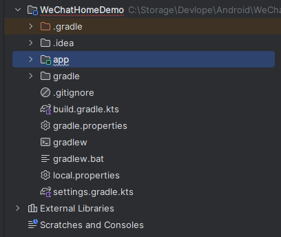

[toc]

## 1. 项目目录




## 2. APP目录

```
app/
├── manifests/
│   └── AndroidManifest.xml
├── java/
│   └── com/
│       └── example/
│           └── wechathomedemo/
│               ├── MainActivity.kt
│               └── ChatAdapter.kt
├── res/
│   ├── layout/
│   │   ├── activity_main.xml
│   │   └── item_chat.xml
│   ├── drawable/
│   ├── mipmap/
│   ├── values/
│   └── xml/
```

### 1. `app/` 目录

`app/` 是项目的主模块目录，包含了应用的所有源代码、资源文件和配置文件。

### 2. `manifests/` 目录

`manifests/` 目录包含应用的清单文件，定义了应用的基本信息、组件、权限等。

- **`AndroidManifest.xml`**：应用的核心配置文件。它描述了应用的名称、图标、版本、组件（活动、服务、广播接收器、内容提供者）、权限、硬件和软件要求等。

### 3. `java/` 目录

`java/` 目录包含应用的所有 Java 或 Kotlin 源代码文件。

- **`com/example/wechathomedemo/`**：项目的包名，用于组织代码。典型地，包名遵循反向域名命名惯例。
  - **`MainActivity.kt`**：主活动文件，定义了应用的主要用户界面和逻辑。活动（Activity）是 Android 应用的基本组件之一，通常对应一个屏幕。
  - **`ChatAdapter.kt`**：RecyclerView 适配器类，用于在 RecyclerView 中显示聊天列表项。适配器负责将数据绑定到视图项，并管理视图的创建和复用。

### 4. `res/` 目录

`res/` 目录包含应用的所有资源文件，如布局文件、图像、字符串等。资源文件允许应用支持多种设备配置和本地化。

- **`layout/` 目录**：包含应用的布局文件，这些文件定义了用户界面。
  - **`activity_main.xml`**：定义了主活动的用户界面布局。在这个示例中，包含了一个标题、RecyclerView 和底部导航按钮。
  - **`item_chat.xml`**：定义了单个聊天项的布局，用于在 RecyclerView 中显示聊天列表。
- **`drawable/` 目录**：包含应用的图像资源，如位图、矢量图等。
- **`mipmap/` 目录**：包含不同分辨率的应用图标。通常用于存储应用启动图标。
- **`values/` 目录**：包含资源值文件，如字符串、颜色、样式等。
  - **`colors.xml`**：定义应用中使用的颜色。
  - **`strings.xml`**：定义应用中使用的字符串常量，支持本地化。
  - **`themes.xml`**：定义应用的主题样式。
- **`xml/` 目录**：包含任意 XML 配置文件，如备份规则、数据提取规则等。
  - **`backup_rules.xml`** 和 **`data_extraction_rules.xml`**：示例文件，用于定义应用的备份和数据提取规则。

### 解释总结

- `manifests/` 目录中定义了应用的基本信息、组件和权限。
- `java/` 目录中存放应用的源代码
- `res/` 目录中存放的是xml和图像，颜色等用于构建视图的资源


### 补充：示例 `AndroidManifest.xml`

举例说明：mainfests

```xml
<manifest xmlns:android="http://schemas.android.com/apk/res/android"
    package="com.example.wechathomedemo">

    <!-- 应用的基本信息 -->
    <application
        android:allowBackup="true"
        android:icon="@mipmap/ic_launcher"
        android:label="@string/app_name"
        android:roundIcon="@mipmap/ic_launcher_round"
        android:supportsRtl="true"
        android:theme="@style/Theme.WeChatHomeDemo">

        <!-- Activity 组件 -->
        <activity android:name=".MainActivity">
            <intent-filter>
                <action android:name="android.intent.action.MAIN" />
                <category android:name="android.intent.category.LAUNCHER" />
            </intent-filter>
        </activity>

        <!-- 其他组件示例 -->
        <service android:name=".MyService" />
        <receiver android:name=".MyBroadcastReceiver" />
        <provider
            android:name=".MyContentProvider"
            android:authorities="com.example.wechathomedemo.provider" />
        
    </application>

    <!-- 应用请求的权限 -->
    <uses-permission android:name="android.permission.INTERNET" />

</manifest>

```

#### 1. `manifest` 元素

- **`package`**：定义应用的包名，这个包名在整个应用中是唯一的。

#### 2. `application` 元素

- **`android:allowBackup`**：允许用户备份应用数据。
- **`android:icon`**：定义应用的图标。
- **`android:label`**：定义应用的名称（会显示在设备上）。
- **`android:roundIcon`**：定义应用的圆形图标（用于某些设备）。
- **`android:supportsRtl`**：支持从右到左的布局。
- **`android:theme`**：定义应用的主题。

#### 3. `uses-permission` 元素

- **`android:name`**：定义应用请求的权限（如访问互联网的权限）。

#### Activity 组件

```xml
<activity android:name=".MainActivity">
    <intent-filter>
        <action android:name="android.intent.action.MAIN" />
        <category android:name="android.intent.category.LAUNCHER" />
    </intent-filter>
</activity>
```

- **`.MainActivity`**：应用的主界面类。
- **`intent-filter`**：定义 MainActivity 为应用的入口，当用户点击应用图标时，这个 Activity 会被启动。

#### Service 组件

```xml
<service android:name=".MyService" />
```

- **`.MyService`**：定义了一个服务，通常用于在后台执行长时间运行的操作。

#### BroadcastReceiver 组件

```xml
<receiver android:name=".MyBroadcastReceiver" />
```

- **`.MyBroadcastReceiver`**：定义了一个广播接收器，用于监听和处理广播消息。

#### ContentProvider 组件

```xml
<provider
    android:name=".MyContentProvider"
    android:authorities="com.example.wechathomedemo.provider" />
```

- **`.MyContentProvider`**：定义了一个内容提供者，用于在应用之间共享数据。
- **`android:authorities`**：定义了内容提供者的唯一标识符 URI。